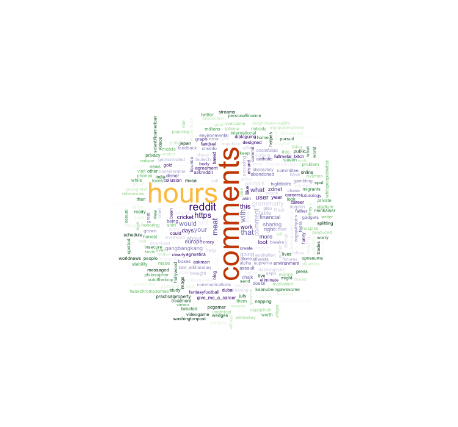

# Introduction to Statistics 
>"An approximate answer to the right problem is worth a good deal more than an exact answer to an approximate problem." 
><div style="text-align: right">
> --- John Tukey </div>

>"To call in the statistician after the experiment is done may be no more than asking him to perform a post-mortem examination: he may be able to say what the experiment died of."
><div style="text-align: right">
> --- Ronald Fisher</div>

First off...

 <h4>Advanced R Challenges</h4>
 
This challenge doesn't have much to do with stats. It's just a fun way to vizualize work you have done. Get the documents from your publications or research papers and visualize them in a word cloud. Here's an example:
```{r wordle, eval=FALSE}
# Wordl Challenge ---------------------------------------------------------
#Create a visual word cloud from a manuscript or publication from your own work.
library(tidyverse) #Load the tidyverse
library(textreadr) #Load the package 'textreadr'


rawtext <- read_docx("path/to/your/file.docx") #Read a word file .doc or .docx and save it to rawtext
rawtext <- read_document("path/to/your/file.pdf") #Read a pdf and save it to rawtext

words.l <- strsplit(rawdata,"\\W") #Split the word strings on the whitespace into lists
text1 <-unlist(words.l) #Turn the list into a vector of characters
d<-as.data.frame(text1) #Save text vector as a data.frame

density<- d %>% #Using dplyr and magritr, go into your data.frame with %>%
  mutate(text1 = tolower(as.character(text1))) %>% #Make all words lowercase
  filter(text1 != "", text1 != grepl("[[:digit:]]+",text1)) %>% #Remove numbers and blanks
  group_by(text1) %>% #Group the data by unique each word
  summarize(count = n()) %>% #Count the number of words of each kind there are
  filter(!grepl("[[:digit:]]+",text1), nchar(text1) > 4) %>% #Filter out words with very few characters
  arrange(desc(count)) #Arrange from highest to lowest

#install.packages("wordcloud")
#install.packages("RcolorBrewer")
require('wordcloud') #Get the wordcloud package
require('RColorBrewer')
pal2 <- brewer.pal(8,"Dark2") #Create a brewer pallete ... see ?
png("ModelingCognitiveWorkload.png", width=750,height=600) #Open a png file to write into
#call wordcloud within the png file, you could also call wordcloud outside of the png file
wordcloud(density$text1, density$count, scale=c(4,.5),min.freq=1,max.words=Inf, random.order=FALSE, rot.per=.15, colors=pal2)
dev.off() #close the png file
```

#Stats {-}

Wordl Website
```{r web, eval=FALSE}
library(rvest)
library(tidyverse)
html_reddit <- read_html("https://www.reddit.com/")

words.l <- html_reddit %>%
  html_nodes("a") %>%
  html_text()
  
text1 <- unlist(strsplit(words.l,"\\W"))

d<-as.data.frame(text1)

density<- d %>%
  mutate(text1 = tolower(as.character(text1))) %>%
  filter(text1 != "", text1 != grepl("[[:digit:]]+",text1)) %>%
  group_by(text1) %>%
  summarize(count = n()) %>%
  filter(!grepl("[[:digit:]]+",text1), nchar(text1) > 3) %>%
  arrange(desc(count))

require('wordcloud')
require('RColorBrewer')
pal2 <- rev(c(rep(brewer.pal(n = 9, "Greens"),15),rep(brewer.pal(n = 8, "Purples"),16),
              "#FEC44F","#CC4C02"))
png("wordcloud_reddit.png", width=750,height=700)
wordcloud(density$text1, density$count, scale=c(4,.5),min.freq=1,max.words=Inf, 
          random.order=F, rot.per=.15, colors=pal2,ordered.colors = T)
dev.off()
```



```{r advancedR}
rm(list = ls());par(mfrow = c(1,1))
require(tidyverse)
#install.packages("lsr")
```

##Steps of Visualization

From Navarro, Page 105...

### Descriptive Stats
```{r load}
load("~/Dropbox/RCOURSE/books_resources/data/aflsmall.Rdata")
library(lsr)
lsr::who()
```

The afl.margins variable contains the winning margin (number of points) for all 176 home and away games played during the 2010 season.

Quick Afl rules:
There are 4 posts, to score:
- Goal (through the two middle posts): 6 points
- Behind (through the outside posts): 1 point
- Ball touched (through any sets of posts): 1 point
- Hits one of the middle posts: 1 point

(Scores are high as you will see)

Here's a vector of winner-loser scores for 176 games in 2010 afl.margins

Let's make sense of this mess.
```{r histstem}
hist(afl.margins, breaks=10)
stem(afl.margins)
```

### Measures of Central Tendency
mean calculation
```{r longmean}
sum(afl.margins)/length(afl.margins)
```
OR
```{r shortmean}
mean(afl.margins)
```

**Challenge 1**
Get the mean of the first five game margins.

**Challenge 2**
Get the median game margin.


Great metaphor for the two: The mean is basically the “centre of gravity” of the data set. If you imagine that the histogram of the data is a solid object, then the point on which you could balance it (as if on a see-saw) is the mean. In contrast, the median is the middle observation. Half of the observations are smaller, and half of the observations are larger.

You can trim the mean:
```{r trim}
mean( x = afl.margins, trim = .05) #Trims 5% of the data off either side

.05*176 #How many scores are trimmed total
```
Get the Mode
```{r mode}
mode(afl.margins)
```
You can create the function from just doing the math.
```{r functionmode}
getmode <- function(v) {
  uniqv <- unique(v)
  uniqv[which.max(tabulate(match(v, uniqv)))]
}

getmode(afl.margins)
```
Mode on a character vector?
```{r lsrMode}
lsr::modeOf(afl.finalists)
table(afl.finalists)
```
How often does the mode occur?
```{r lsrmaxfreq}
maxFreq( x = afl.finalists )
```
### Measures of Variability

```{r variability}
max(afl.margins)
min(afl.margins)
range( afl.margins )
quantile( x = afl.margins, probs = .5)
quantile(afl.margins, probs = c(.25,.5,.75))
IQR( x = afl.margins ) # Inter-quartile range
```
OR
```{r quantile}
quantile(afl.margins, probs = .75) - quantile(afl.margins, probs = .25)
```
Mean absolute deviation
```{r aad}
lsr::aad(afl.margins)
```
what does aad do?   

hint:
```{r look inside}
aad #You can look into functions by not adding the ()
```
```{r abs}
mean(abs(afl.margins - mean(afl.margins)))
```
Variance (mean squared deviation)
```{r variance}
mean( (afl.margins - mean(afl.margins) )^2)
var(afl.margins)
sd(afl.margins)
```

**Challenge 3** Show the standard deviation in a graph.   


**Challenge 4** Calculate histogram, but do not draw it.


Skew and kurtosis from psych library
```{r psychskew}
library(psych)
skew(afl.margins)
kurtosi(afl.margins)
```

```{r explain, eval=FALSE}
q <- rbind(c("too flat", "platykurtic", "negative"),
      rbind(c("just pointy enough", "mesokurtic", "zero"),
c("too pointy", "leptokurtic", "positive")))
colnames(q) <- c("informal term", "technical name", "kurtosis value")
data.frame(q)

#        informal.term technical.name kurtosis.value
# 1           too flat    platykurtic       negative
# 2 just pointy enough     mesokurtic           zero
# 3         too pointy    leptokurtic       positive
```

Get it all
```{r}
describe(afl.margins)
```
## Clinical Trial Example
```{r}
#New dataset
load("~/Dropbox/RCOURSE/books_resources/data/clinicaltrial.Rdata")
psych::describe(clin.trial)

describeBy(clin.trial, group = c("drug","therapy"))

by(data = clin.trial, INDICES = clin.trial$therapy, FUN = describe)
by(data = clin.trial, INDICES = clin.trial$therapy, FUN = summary)
```

##Correlations
Here is an example of correlations with the mtcars dataset from <code>datasets</code>.
```{r correlations}
df <- datasets::mtcars
cor(mtcars$mpg, mtcars$disp)

plot(mtcars$mpg, mtcars$disp)
```

Here's the work dataset from Navarro.
```{r work}
load("~/Dropbox/RCOURSE/books_resources/data/work.Rdata")
head(work)
```

and here's a correlation between work hours and pay.
```{r workcors}
cor(work$hours, work$pay)
plot(work$hours, work$pay)
lsr::correlate(work) #Gives a correlation table
lsr::correlate(work, corr.method = "spearman")
cor.test(mtcars$mpg, mtcars$disp) #For paired samples
```
## Categorical Data -- Navarro pg. 351

### Chi Square goodness-of-fit test (Pearson, 1900) Review
```{r}
load("~/Dropbox/RCOURSE/books_resources/data/randomness.Rdata")

head(cards)
observed <- table(cards$choice_1)
observed
```
H0 - all four suits are chosen with equal probability   
H1 - at least one of the suit-choice probabilities isn't .25    

```{r probabilities}
probabilities <- c(clubs = .25, diamonds = .25, hearts = .25, spades = .25)
probabilities
N <- length(cards[,1])
expected <- N*probabilities #expected frequencies
expected

observed - expected
```

Get absolute difference (no negative or positive)
```{r chisquare}
sum(((observed - expected)^2)/expected)

qchisq(p = .95, df = 3) #Gives you a value to reject the null hypothesis
```
If we want the p-value we can calculate with...
```{r}
pchisq(q = sum(((observed - expected)^2)/expected), df = 3, lower.tail = FALSE)
```
Degrees of freedom is outcomes (k) - 1

How to skip all those steps:
```{r goodnessoffit}
lsr::goodnessOfFitTest(cards$choice_1)
```
Specify null hypothesis:
```{r null}
nullProbs <- c(clubs = .2, diamonds = .3, hearts = .3, spades = .2)

goodnessOfFitTest(cards$choice_1, p = nullProbs)
```
### Chi-square test of independence
Get the chapek9 dataset:
```{r loaddata}
load("~/Dropbox/RCOURSE/books_resources/data/chapek9.Rdata")
summary(chapek9)
```
This is a screening test to determine of somebody is a human or a robot. The entity is asked whether they prefer a puppy, a flower, or a properly formatted database.
```{r xtabs}
xtabs(formula = ~choice+species, data = chapek9)
```
1. Null, variables are independent
2. Alternative, variables are related

```{r assoctest}
associationTest(formula = ~choice+species, data = chapek9)
```

Most typical way to do the test...
```{r chisqtest}
chisq.test(observed, p = c(.2,.3,.3,.2))

chisq.test(xtabs(formula = ~choice+species, data = chapek9))
```
(Also see <code>?fisher.test()</code>, <code>mcnemar.test()</code>)

##T.TEST
Load harpo dataset
```{r harpo}
load("~/Dropbox/RCOURSE/books_resources/data/harpo.Rdata")
```
...and describe it:
```{r harpodescribe}
head(harpo)
describeBy(harpo,group = "tutor")
```
Here's the independent samples t.test:
```{r ist}
lsr::independentSamplesTTest(formula = grade~tutor,
                             data = harpo,
                             var.equal = T)
```
OR
```{r t.test}
t.test(grade~tutor, data = harpo, var.equal = T, paired = F, conf.level = .95)
```

##Effect Size
```{r cohensD}
cohensD(grade~tutor, data = harpo, method = "pooled")

cohensD(grade~tutor, data = harpo, method = "unequal")
```
##Assumptions
Check some plots, and you can look at normality.
```{r qqnorm}
hist(harpo$grade, breaks = 15)
qqnorm(harpo$grade)
```
###Shapiro normality test
```{r shapiro}
shapiro.test(harpo$grade)
```
Or use wilcoxon test for non-normal samples:
```{r wilcox}
wilcox.test(grade~tutor, data = harpo)
```

##One-Way ANOVA
back to the clin.trial dataset
```{r meansd}
aggregate(mood.gain ~drug, clin.trial, mean)
aggregate(mood.gain ~drug, clin.trial, sd)
```

Here's a plot of means with sd errorbars.
```{r fullplot}
clin.trial %>%
  group_by(drug) %>%
  summarise(m.mood = mean(mood.gain), sd.mood = sd(mood.gain)) %>%
  ggplot(aes(x = drug, y = m.mood)) + geom_point() + theme_classic() +
  coord_cartesian(ylim = c(0,2)) + 
  geom_errorbar(aes(ymax = m.mood + sd.mood, 
                    ymin = m.mood - sd.mood), width = .25)
```
...and now for the anova...
```{r aov}
my.anova <- aov(formula = mood.gain~drug, data = clin.trial)
```
What is this <code>my.anova</code> object?
```{r aovdescribe}
class(my.anova)
names(my.anova)
summary(my.anova)
```

Here's a test of effect size for the ANOVA
```{r}
lsr::etaSquared(my.anova)
```
and posthoc pairwise comparisons of levels of a factor

```{r posthoc}
posthocPairwiseT(my.anova, p.adjust.method = "none")
```
or corrected for assumptions
```{r corrected}
posthocPairwiseT(my.anova, p.adjust.method = "bonferroni")
```
and a test for homogeneity of variance from the <code>car</code> package.
```{r car}
require(car) #Test for homogeneity of variance
car::leveneTest(my.anova)
```

##AAAANNDD Regression

```{r getparenthood}
load("~/Dropbox/RCOURSE/books_resources/data/parenthood.Rdata")
head(parenthood)
```
Here's the linear model.
```{r model}
regres1 <- lm(formula = dan.grump~dan.sleep, data = parenthood)
```
You can plot it and print a summary.
```{r}
plot(regres1)
summary(regres1)
```
Here's a model with an interaction.

```{r model2}
regres2 <- lm(formula = dan.grump~dan.sleep * baby.sleep, data = parenthood)
```
Finally, you can plot 3 predictors in a 3d plot.
```{r scatter}
scatter3d(z = parenthood$baby.sleep, 
          x = parenthood$dan.grump, 
          y = parenthood$dan.sleep)
```

These statistics are presented very quickly and have a large background of omitted information, assumptions, and history. You should seek out readings or classes that focus on statistics before employing these tests. This lesson only covers how to apply these tests to data in the context of R.

##Solutions
**Challenge 1**
Get the mean of the first five game margins.
```{r challenge1}
mean(afl.margins[1:5])
```

**Challenge 2**
Get the median game margin.
```{r median}
median(afl.margins)
```
...pretty close...
```{r middle}
176/2
sort(afl.margins)[88]
```

**Challenge 3** Show the standard deviation in a graph.  
```{r solutions}
my_hist=hist(afl.margins, breaks=10  , plot=F)
# Color vector
my_color= ifelse(my_hist$breaks < (mean(afl.margins) - sd(afl.margins)), "purple" , ifelse (my_hist$breaks >=(mean(afl.margins) + sd(afl.margins)), "purple", rgb(0.2,0.2,0.2,0.2) ))
# Final plot
plot(my_hist, col=my_color , border=F , main="" , xlab="value of the variable", xlim=c(0,125))
abline(v = mean(afl.margins), col = "blue")
```

**Challenge 4** Calculate histogram, but do not draw it.
```{r challenge4}
hist(afl.margins, breaks=10  , plot=F)
```

