# Data Transformation Day 2 

>“Every day, three times per second, we produce the equivalent of the amount of data that the Library of Congress has in its entire print collection, right? But most of it is like cat videos on YouTube or 13-year-olds exchanging text messages about the next Twilight movie.” 
><div style="text-align: right">
> --- Nate Silver </div>

First off...

 <h4>Advanced R Challenges</h4>
 
 Explain how the order of factors changed within the plots for dat2. How do facet_grid and
facet_wrap work?

```r
#Can you reorder
library(ggplot2)
library(dplyr)
library(forcats)
dat2 <- structure(list(School = structure(c(2L, 2L, 2L, 1L, 1L, 1L, 3L, 
                                            3L, 3L), .Label = c("School1", "School2", "School3"), class = "factor"), 
                       Year = c(2015L, 2014L, 2013L, 2015L, 2014L, 2013L, 2015L, 
                                2014L, 2013L), Rate = c(80L, 90L, 11L, 70L, 50L, 30L, 60L, 
                                                        50L, 40L), Order = c(1L, 1L, 1L, 2L, 2L, 2L, 3L, 3L, 3L), 
                       Order2 = c(1L, 2L, 3L, 1L, 2L, 3L, 1L, 2L, 3L), 
                       Order3 = structure(c(NA_integer_,
                                            NA_integer_, NA_integer_, NA_integer_, NA_integer_, NA_integer_, 
                                            NA_integer_, NA_integer_, NA_integer_), 
                                          .Label = c("School2","School1","School3"), class = "factor")),
                  .Names = c("School","Year", "Rate", "Order", "Order2", "Order3"), 
                  row.names = c(NA,-9L), class = c("tbl_df", "tbl", "data.frame")) %>%
  mutate(School = fct_relevel(School, c("School2","School1","School3")))


p <- ggplot(dat2, aes(x=reorder(Year,Order2), Rate), labels = c("School1","School2","School3")) +
  geom_bar(stat = "identity", width = 0.5)
p + facet_grid(. ~School)


dat2 %>%
  mutate(School = fct_relevel(School, c("School2","School1","School3"))) %>%
  ggplot(aes(x=reorder(Year,Order2), Rate), labels = c("School1","School2","School3")) +
  geom_bar(stat = "identity", width = 0.5) +
  facet_grid(. ~School)
```
 
## Day 2 {-}


_Note_: Much of this lesson can be found in the "factors" chapter of R for Data Science by Hadley Wickham: http://r4ds.had.co.nz/factors.html


```r
?gss_cat #See more about the variables in our dataset

View(gss_cat)
```


```r
gss_cat %>%
  count(race) #We can see counts of each race or religion
#> # A tibble: 3 × 2
#>   race      n
#>   <fct> <int>
#> 1 Other  1959
#> 2 Black  3129
#> 3 White 16395

gss_cat %>%
  count(relig) %>%
  arrange(desc(n)) #We can arrange them in descending order on the count column (n)
#> # A tibble: 15 × 2
#>   relig          n
#>   <fct>      <int>
#> 1 Protestant 10846
#> 2 Catholic    5124
#> 3 None        3523
#> 4 Christian    689
#> 5 Jewish       388
#> 6 Other        224
#> # … with 9 more rows

gss_cat %>%
  count(age) #Or we can count by age...
#> # A tibble: 73 × 2
#>     age     n
#>   <int> <int>
#> 1    18    91
#> 2    19   249
#> 3    20   251
#> 4    21   278
#> 5    22   298
#> 6    23   361
#> # … with 67 more rows


gss_cat %>%
  count(race) %>%
  mutate(freq = (n / sum(n))*100) #We can see relative proportions in the sample
#> # A tibble: 3 × 3
#>   race      n  freq
#>   <fct> <int> <dbl>
#> 1 Other  1959  9.12
#> 2 Black  3129 14.6 
#> 3 White 16395 76.3

levels(gss_cat$rincome)
#>  [1] "No answer"      "Don't know"     "Refused"        "$25000 or more"
#>  [5] "$20000 - 24999" "$15000 - 19999" "$10000 - 14999" "$8000 to 9999" 
#>  [9] "$7000 to 7999"  "$6000 to 6999"  "$5000 to 5999"  "$4000 to 4999" 
#> [13] "$3000 to 3999"  "$1000 to 2999"  "Lt $1000"       "Not applicable"
#Releveling factors with forcats
df <- forcats::gss_cat
```


```r
#Remember, none of these outcomes are being saved into any objects with <- 
#This is just for visualizing and exploring the data.

#We can visualize this information with ggplot2
require(ggplot2) #We will get more into ggplot next week, 
#but for now here is an introduction.

ggplot(data = gss_cat, mapping = aes(x =race)) +
  geom_bar()


# By default, ggplot2 will drop levels that don’t have any values. 
# You can force them to display with:
ggplot(gss_cat, aes(race)) +
  geom_bar() +
  scale_x_discrete(drop = FALSE)
```

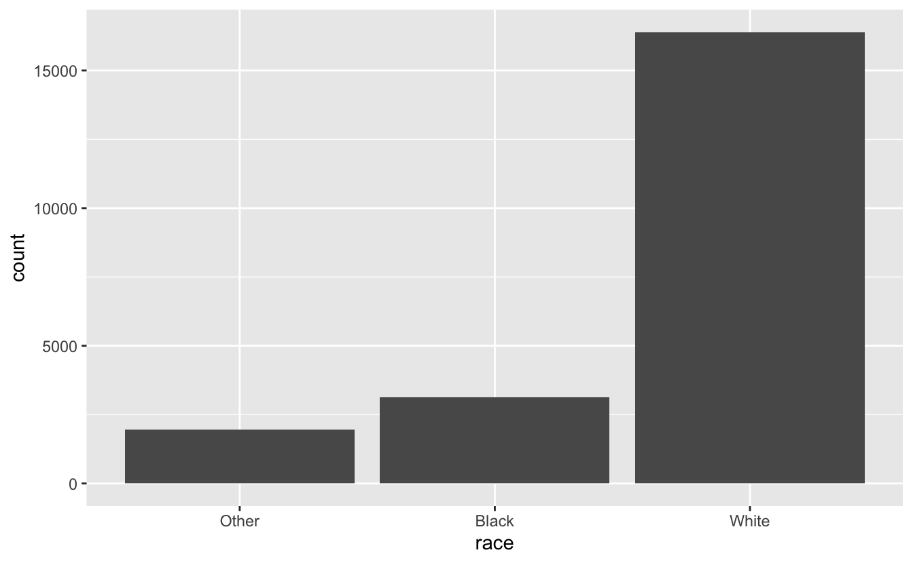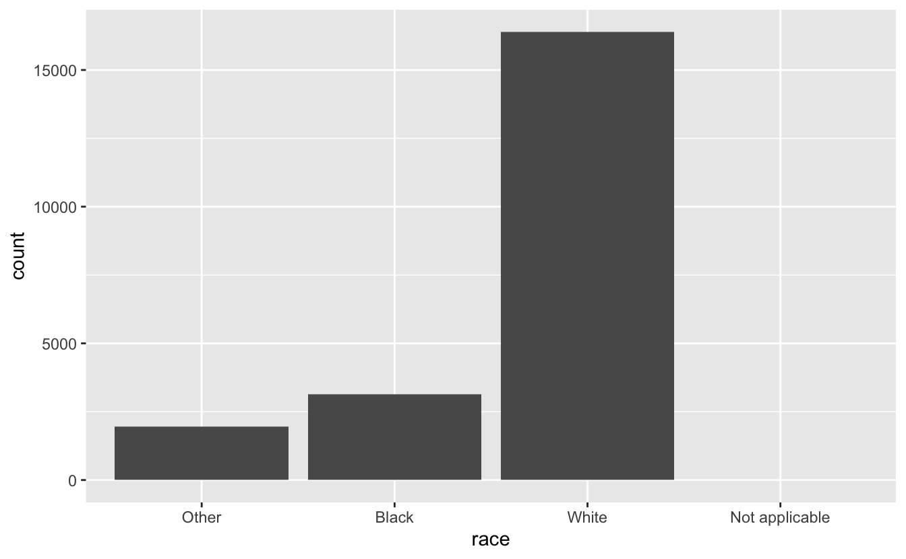

When working with factors, the two most common operations are:
1. Changing the order of the levels
2. Changing the values of the levels.

Why would you want to do this?

It’s often useful to change the order of the factor levels in a visualisation.

Let's get the average number of hours spent watching TV per day across religions:

Note: if you put () on the outside of your assignment, it will also print


```r
(relig_summary <- df %>% #Get your data.frame and pipe into the columns
  group_by(relig) %>% #group by religion so that each summary will be for one religion
  summarise( #Get a summary for the following transformations
    age = mean(age, na.rm = T), #Get the mean of age and name it "age"
    tvhours = mean(tvhours, na.rm = TRUE), #Get the mean of tv hours and name it "tvhours"
    n = n() #Count the number of observations in each group
  ))
#> # A tibble: 15 × 4
#>   relig                     age tvhours     n
#>   <fct>                   <dbl>   <dbl> <int>
#> 1 No answer                49.5    2.72    93
#> 2 Don't know               35.9    4.62    15
#> 3 Inter-nondenominational  40.0    2.87   109
#> 4 Native american          38.9    3.46    23
#> 5 Christian                40.1    2.79   689
#> 6 Orthodox-christian       50.4    2.42    95
#> # … with 9 more rows
```
Because there were NA's and we wanted to do math we needed to remove them with:
na.rm = TRUE

## Change the order of the levels

Plot with ggplot, arguments are ggplot(data, mapping) + geom_type()
mapping is usually paired with the aes() function, which refers to aesthetics
arguments to aes are usually aes(x, y, group)

```r
ggplot(data = relig_summary, 
       mapping = aes(y = relig, x =tvhours)) + 
  geom_point()
```

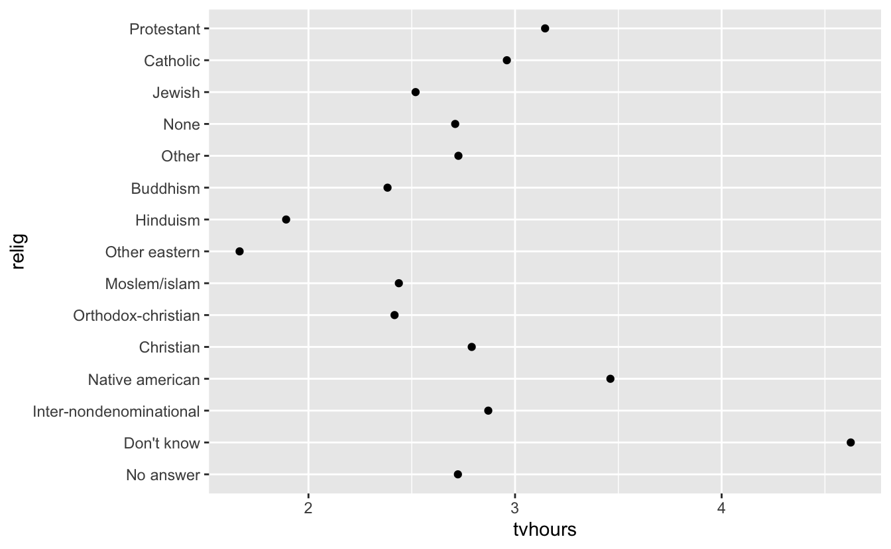

Interesting, but we could pack more info into this visualization


```r
ggplot(relig_summary, aes(x = tvhours, y = fct_reorder(.f = relig, .x = tvhours))) +
  geom_point()
```

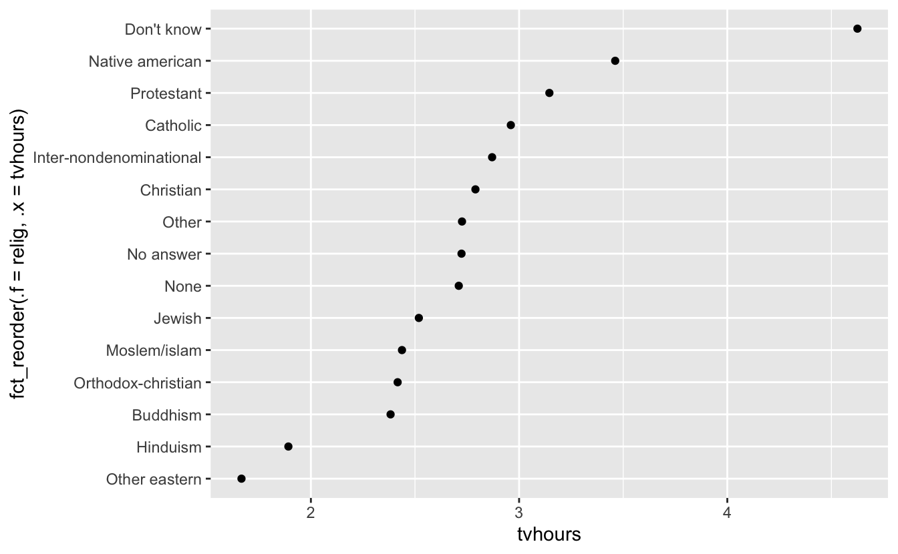

Now we have reordered religion by tv hours watched.

The key argument is fct_reorder("factor to order", "column to be ordered by")

We can do it in descending order as well:

```r
ggplot(relig_summary, aes(tvhours, fct_reorder(relig, desc(tvhours)))) +
  geom_point() 
```

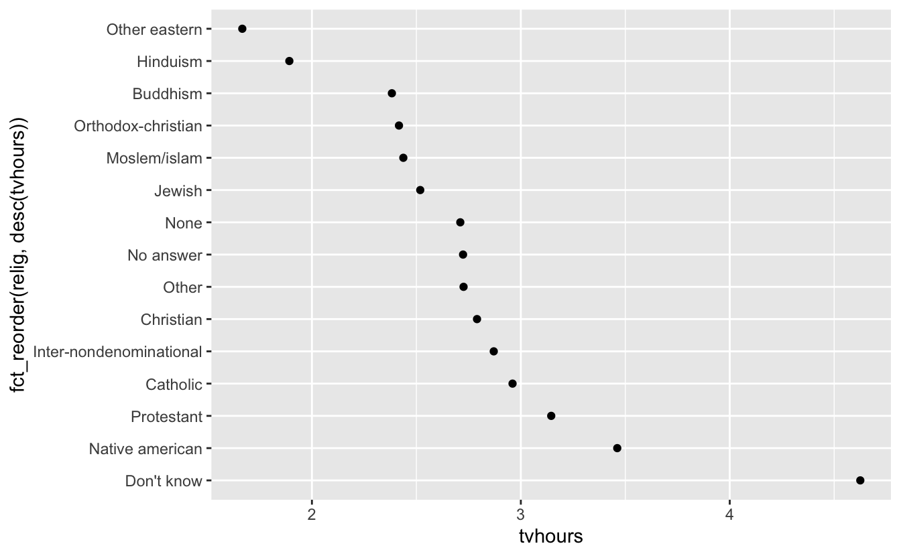
We just put desc() around tvhours

As you start making more complicated transformations,
I’d recommend moving them out of aes() and into a separate mutate() step.
For example, you could rewrite the plot above as:


```r
relig_summary %>%
  mutate(relig = fct_reorder(relig, tvhours)) %>%
  ggplot(aes(tvhours, relig)) +
  geom_point()

mtv <- relig_summary %>%
  summarise(mtv = mean(tvhours))

relig_summary %>% ggplot(aes(x = tvhours, y = relig, color = relig)
) + geom_point() + geom_vline(aes(xintercept = mtv$mtv)) 

levels(relig_summary$relig)
#>  [1] "No answer"               "Don't know"             
#>  [3] "Inter-nondenominational" "Native american"        
#>  [5] "Christian"               "Orthodox-christian"     
#>  [7] "Moslem/islam"            "Other eastern"          
#>  [9] "Hinduism"                "Buddhism"               
#> [11] "Other"                   "None"                   
#> [13] "Jewish"                  "Catholic"               
#> [15] "Protestant"              "Not applicable"

(testlevel <- relig_summary %>%
  mutate(relig = fct_reorder(relig, tvhours)))
#> # A tibble: 15 × 4
#>   relig                     age tvhours     n
#>   <fct>                   <dbl>   <dbl> <int>
#> 1 No answer                49.5    2.72    93
#> 2 Don't know               35.9    4.62    15
#> 3 Inter-nondenominational  40.0    2.87   109
#> 4 Native american          38.9    3.46    23
#> 5 Christian                40.1    2.79   689
#> 6 Orthodox-christian       50.4    2.42    95
#> # … with 9 more rows

levels(testlevel$relig) #The levels have changed even if the visualization did not.
#>  [1] "Other eastern"           "Hinduism"               
#>  [3] "Buddhism"                "Orthodox-christian"     
#>  [5] "Moslem/islam"            "Jewish"                 
#>  [7] "None"                    "No answer"              
#>  [9] "Other"                   "Christian"              
#> [11] "Inter-nondenominational" "Catholic"               
#> [13] "Protestant"              "Native american"        
#> [15] "Don't know"              "Not applicable"
```

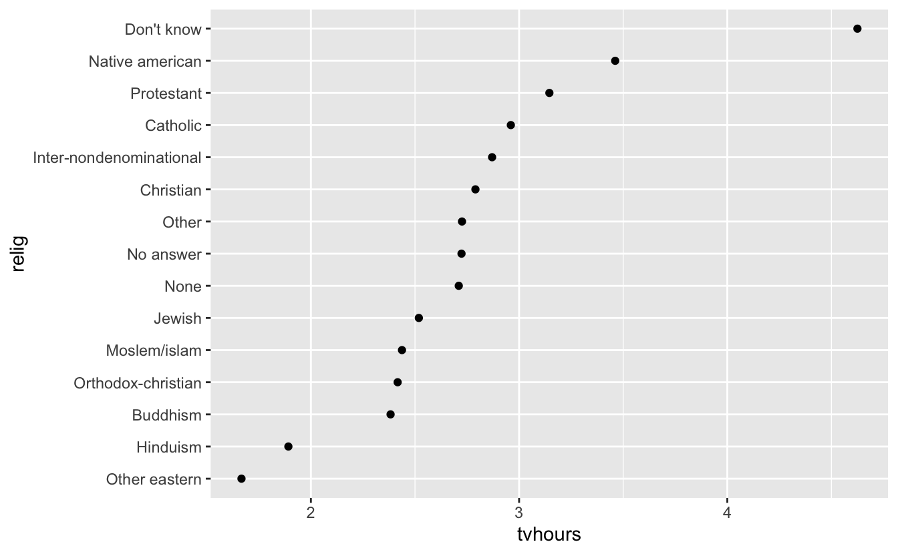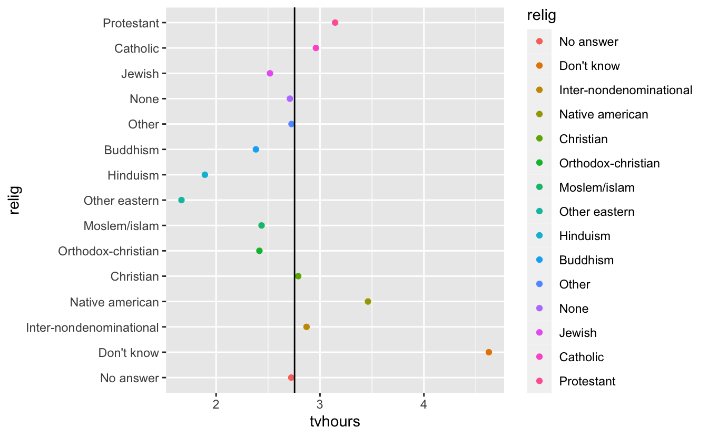

This is most important for plotting

Let's look at how average age varies across reported income level:


```r
(rincome_summary <- df %>% #Save your df summary as something descriptive
  group_by(rincome) %>% #Group by income so that all summaries will be for those levels
  summarise( #Create summaries for the following:
    age = mean(age, na.rm = TRUE), #Mean age with Na's removed named "age"
    tvhours = mean(tvhours, na.rm = TRUE), #Mean tvhours named "tvhours"
    n = n() #Count number of observations in each column
  ))
#> # A tibble: 16 × 4
#>   rincome          age tvhours     n
#>   <fct>          <dbl>   <dbl> <int>
#> 1 No answer       45.5    2.90   183
#> 2 Don't know      45.6    3.41   267
#> 3 Refused         47.6    2.48   975
#> 4 $25000 or more  44.2    2.23  7363
#> 5 $20000 - 24999  41.5    2.78  1283
#> 6 $15000 - 19999  40.0    2.91  1048
#> # … with 10 more rows

ggplot(rincome_summary, aes(age, fct_reorder(rincome, age))) + 
  geom_point()
```

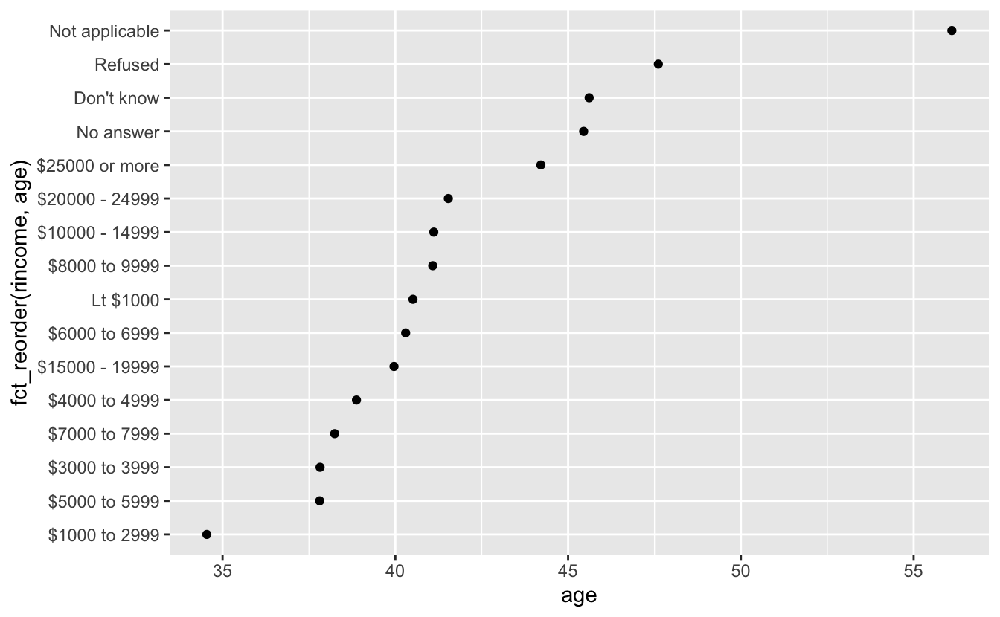

Reported income is an ordinal variable so it should be reported that way
However fct_reorder will often create an arbitrary order by the second argument
(age in this case).

Use fct_relevel to have an ordered outcome:

```r
ggplot(rincome_summary, aes(age, fct_relevel(rincome))) +
  geom_point()
```


Now "Not applicable" is up at the top away from the other "special responses"
Let's fix that:

```r
ggplot(rincome_summary, aes(age, fct_relevel(rincome, "Not applicable"))) +
  geom_point()
```

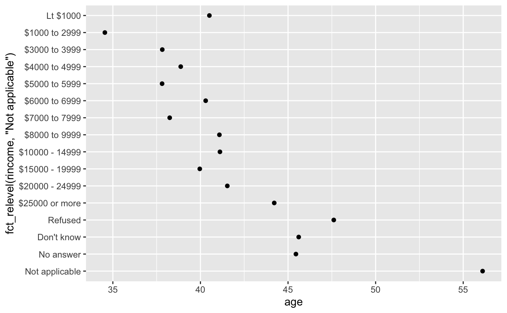
We put it at the end! Now age and income are ordered! However, larger numbers
map to the top (Larger is higher in conceptual metaphor theory)


```r
ggplot(rincome_summary, aes(age,x = fct_relevel(desc(rincome), "Not applicable"))) +
  geom_point() 

```

This doesn't work in the aes() function, so we have to do it earlier!


```r
ordered_rincome <-rincome_summary %>%
  mutate(rincome = fct_relevel(rincome, "Not applicable", after = 0))

levels(ordered_rincome$rincome) #not applicable has moved...
#>  [1] "Not applicable" "No answer"      "Don't know"     "Refused"       
#>  [5] "$25000 or more" "$20000 - 24999" "$15000 - 19999" "$10000 - 14999"
#>  [9] "$8000 to 9999"  "$7000 to 7999"  "$6000 to 6999"  "$5000 to 5999" 
#> [13] "$4000 to 4999"  "$3000 to 3999"  "$1000 to 2999"  "Lt $1000"

ggplot(ordered_rincome, aes(age, fct_relevel(rincome, "Not applicable"))) +
  geom_point() #But still plotting int he wrong order

ordered_rincome <- rincome_summary %>%
  mutate(rincome = fct_relevel(rincome, "Not applicable", after = 0)) %>%
  mutate(rincome = fct_rev(rincome)) %>% #Now we can use fct_rev()
  filter(rincome != "Not applicable",
         rincome != "No answer")

ggplot(ordered_rincome, aes(age,rincome)) +
  geom_point()
```

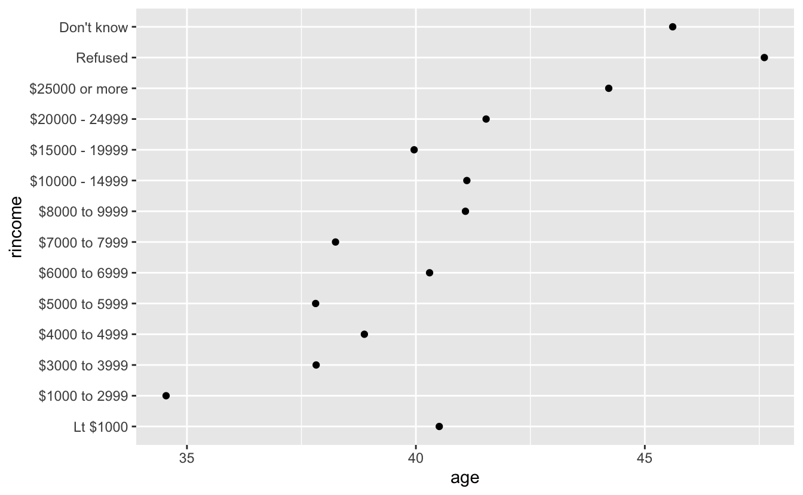

Let's do some more reordering:


```r
by_age <- data.frame(df) %>% #Get data.frame
  na.omit() %>% #Get rid of Na's in age to do maths
  count(age, marital) %>% # count observations by age and marital status
  group_by(age) %>% #Group by age for the following summary
  mutate(prop = n / sum(n)) #Get proportion of counts per age

ggplot(by_age, aes(age, prop, colour = marital)) +
  geom_line(na.rm = TRUE)

ggplot(by_age, aes(age, prop, colour = fct_reorder2(marital, age, prop))) +
  geom_line() +
  labs(colour = "marital")
```

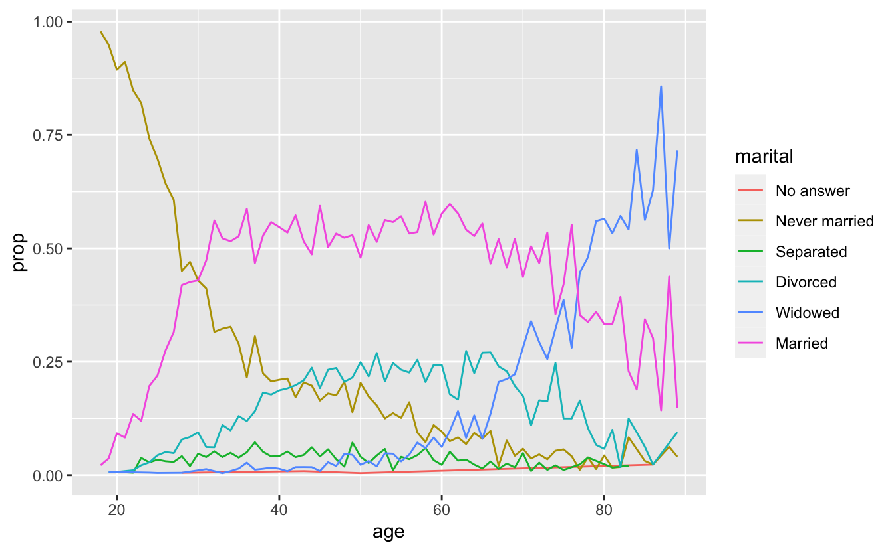


## RcolorBrewer

Let's get researched colors for proper visualization best practices from:
 Brewer, Cynthia A., 200x. http://www.ColorBrewer.org, accessed 09/27/2018.

```r
library(RColorBrewer)


brewer.pal.info
#>          maxcolors category colorblind
#> BrBG            11      div       TRUE
#> PiYG            11      div       TRUE
#> PRGn            11      div       TRUE
#> PuOr            11      div       TRUE
#> RdBu            11      div       TRUE
#> RdGy            11      div      FALSE
#> RdYlBu          11      div       TRUE
#> RdYlGn          11      div      FALSE
#> Spectral        11      div      FALSE
#> Accent           8     qual      FALSE
#> Dark2            8     qual       TRUE
#> Paired          12     qual       TRUE
#> Pastel1          9     qual      FALSE
#> Pastel2          8     qual      FALSE
#> Set1             9     qual      FALSE
#> Set2             8     qual       TRUE
#> Set3            12     qual      FALSE
#> Blues            9      seq       TRUE
#> BuGn             9      seq       TRUE
#> BuPu             9      seq       TRUE
#> GnBu             9      seq       TRUE
#> Greens           9      seq       TRUE
#> Greys            9      seq       TRUE
#> Oranges          9      seq       TRUE
#> OrRd             9      seq       TRUE
#> PuBu             9      seq       TRUE
#> PuBuGn           9      seq       TRUE
#> PuRd             9      seq       TRUE
#> Purples          9      seq       TRUE
#> RdPu             9      seq       TRUE
#> Reds             9      seq       TRUE
#> YlGn             9      seq       TRUE
#> YlGnBu           9      seq       TRUE
#> YlOrBr           9      seq       TRUE
#> YlOrRd           9      seq       TRUE

pal1 <- brewer.pal(n = 6, "Dark2") #Try different palettes


display.brewer.all()

ggplot(by_age, aes(age, prop, colour = fct_reorder2(marital, age, prop))) +
  scale_color_brewer(palette = "Dark2") +
  geom_line() + theme_classic() +
  labs(colour = "marital")

  
ggplot(by_age, aes(age, prop, colour = fct_reorder2(marital, age, prop))) +
  geom_line() +
  labs(colour = "marital") + theme_dark() +
  scale_color_brewer(palette = "Accent")

ggplot(by_age, aes(age, prop, colour = fct_reorder2(marital, age, prop))) +
  geom_line() +
  labs(colour = "marital") + theme_void() +
  scale_color_brewer(type = "qual")
```

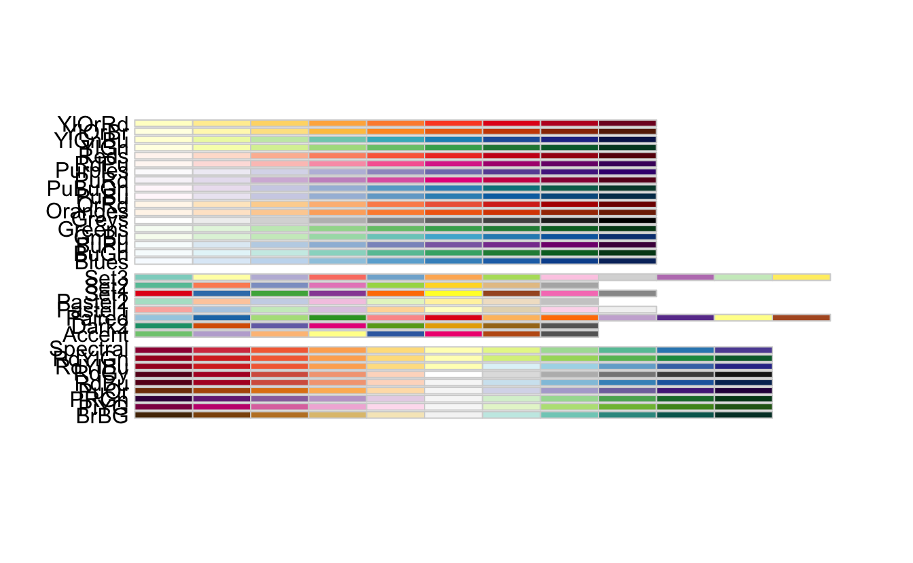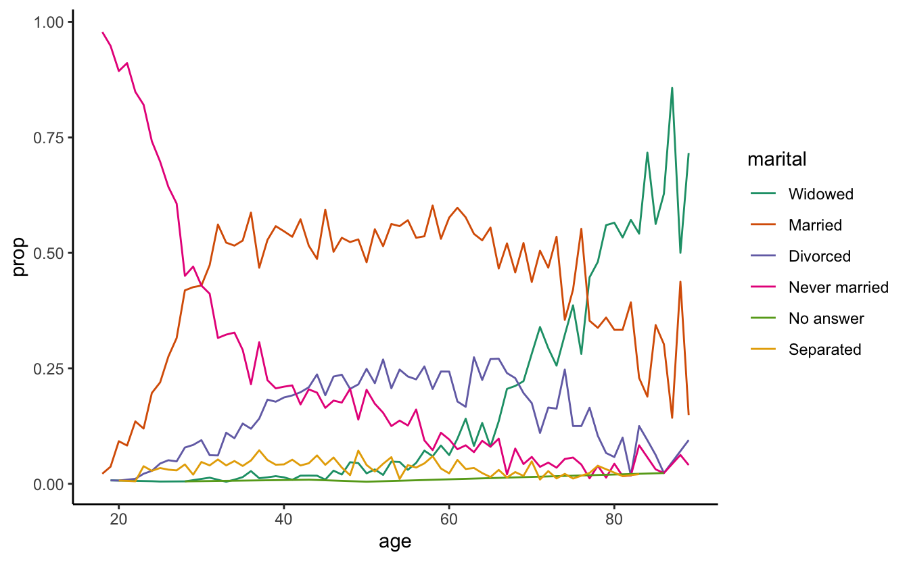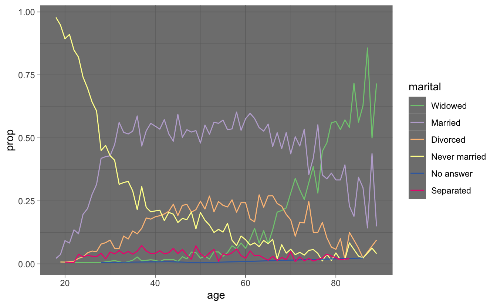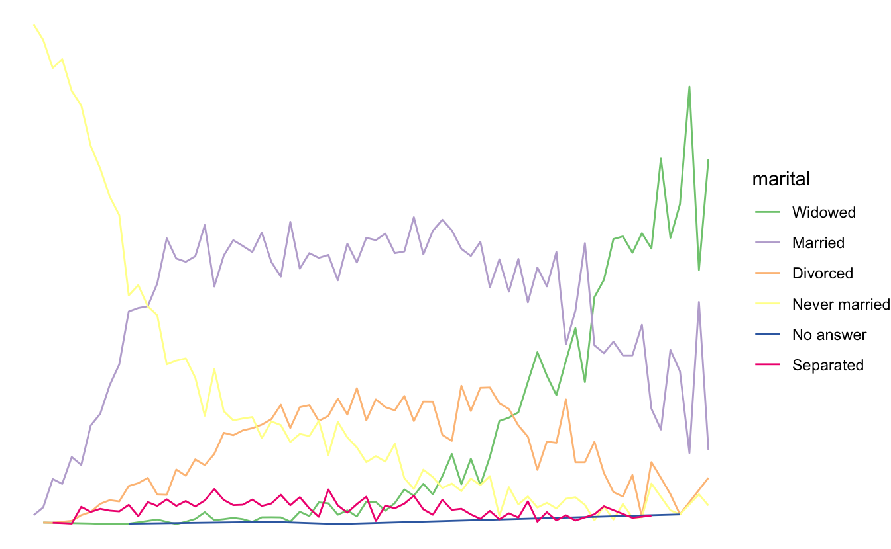

Finally, for bar plots, you can use <code>fct_infreq()</code> to order levels in increasing frequency: this is the simplest type of reordering because it doesn’t need any extra variables. You may want to combine with <code>fct_rev()</code>.


```r
df %>%
  mutate(marital = marital %>% fct_infreq() %>% fct_rev()) %>% 
  ggplot(aes(marital)) +
  geom_bar()
```

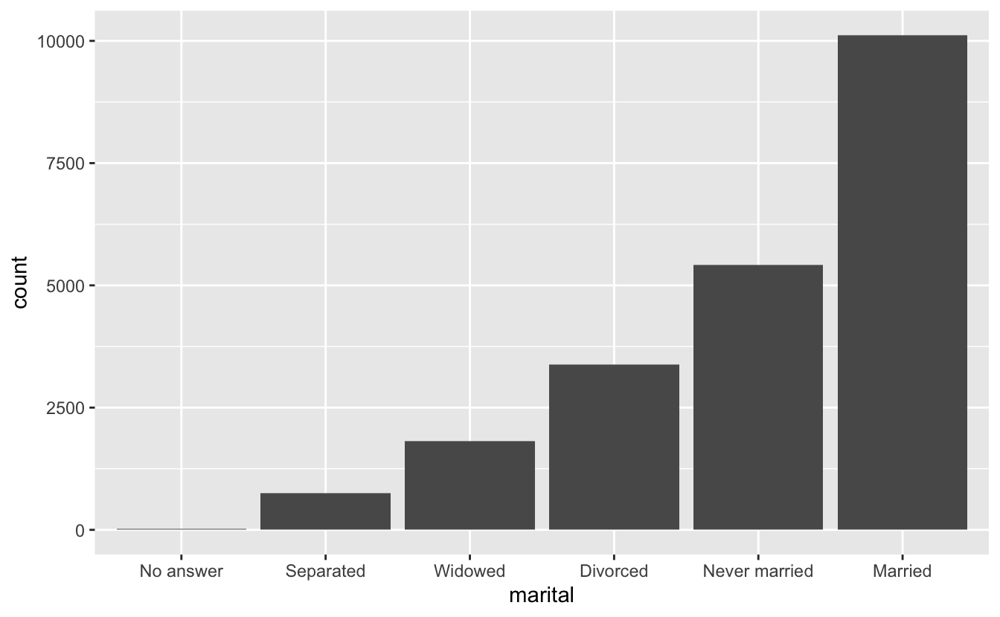
Notice that you can pipe these arguments WITHIN the mutate() function!

**Challenge 1**

For each factor in df identify whether the order of the levels is arbitrary or principled.

```r
rev(levels(df$marital))
#> [1] "Married"       "Widowed"       "Divorced"      "Separated"    
#> [5] "Never married" "No answer"

ggplot(df, aes(year,fill = relig)) + 
  geom_histogram(bins = 8) +
  scale_fill_brewer(palette = "Set3")
#> Warning in RColorBrewer::brewer.pal(n, pal): n too large, allowed maximum for palette Set3 is 12
#> Returning the palette you asked for with that many colors

ggplot(df, aes(year,fill = fct_lump(relig,n = 8))) + 
  geom_histogram(bins = 8) +
  scale_fill_brewer(palette = "Set3")
```

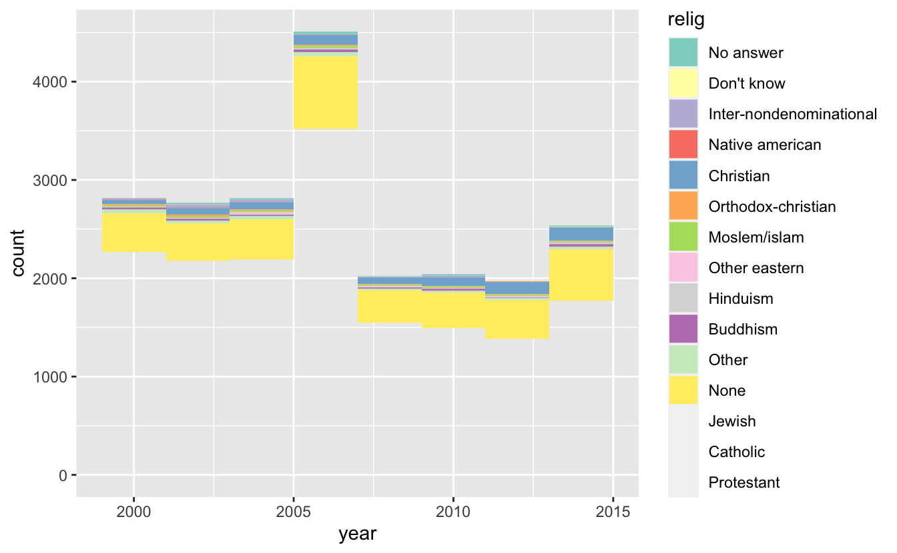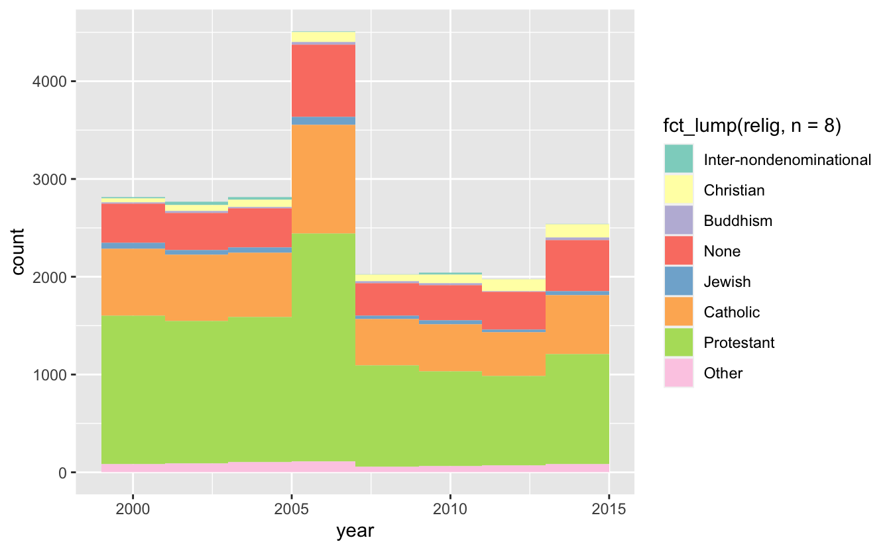

How would you determine this?


## Modifying Factor Levels

Here's a count of the levels in party_id

```r
df %>% count(partyid)
#> # A tibble: 10 × 2
#>   partyid                n
#>   <fct>              <int>
#> 1 No answer            154
#> 2 Don't know             1
#> 3 Other party          393
#> 4 Strong republican   2314
#> 5 Not str republican  3032
#> 6 Ind,near rep        1791
#> # … with 4 more rows
```
<code>fct_recode</code> let's us rename variables (new varname left = old varname right)


```r
df %>%
  mutate(partyid = fct_recode(partyid,
                              "Republican, strong"    = "Strong republican",
                              "Republican, weak"      = "Not str republican",
                              "Independent, near rep" = "Ind,near rep",
                              "Independent, near dem" = "Ind,near dem",
                              "Democrat, weak"        = "Not str democrat",
                              "Democrat, strong"      = "Strong democrat"
  )) %>%
  count(partyid) #Count party ID
#> # A tibble: 10 × 2
#>   partyid                   n
#>   <fct>                 <int>
#> 1 No answer               154
#> 2 Don't know                1
#> 3 Other party             393
#> 4 Republican, strong     2314
#> 5 Republican, weak       3032
#> 6 Independent, near rep  1791
#> # … with 4 more rows
```

<code>fct_recode()</code> will leave levels that aren’t explicitly mentioned as is, 
and will warn you if you accidentally refer to a level that doesn’t exist.

If you want to collapse a lot of levels, <code>fct_collapse()</code> is a useful variant of <code>fct_recode()</code>.
For each new variable, you can provide a vector of old levels:


```r
df %>%
  mutate(partyid = fct_collapse(partyid,
                                other = c("No answer", "Don't know", "Other party"),
                                rep = c("Strong republican", "Not str republican"),
                                ind = c("Ind,near rep", "Independent", "Ind,near dem"),
                                dem = c("Not str democrat", "Strong democrat")
  )) %>%
  count(partyid)
#> # A tibble: 4 × 2
#>   partyid     n
#>   <fct>   <int>
#> 1 other     548
#> 2 rep      5346
#> 3 ind      8409
#> 4 dem      7180
```

Pretty cool huh?! We just created in groupings to plot or do analyses on.

Sometimes you just want to lump together all the small groups to make a plot or table simpler. 
That’s the job of <code>fct_lump()</code>


```r
df %>%
  count(relig) #This is before lumping
#> # A tibble: 15 × 2
#>   relig                       n
#>   <fct>                   <int>
#> 1 No answer                  93
#> 2 Don't know                 15
#> 3 Inter-nondenominational   109
#> 4 Native american            23
#> 5 Christian                 689
#> 6 Orthodox-christian         95
#> # … with 9 more rows

df %>%
  mutate(marital = fct_lump(marital)) %>%
  count(marital)
#> # A tibble: 4 × 2
#>   marital           n
#>   <fct>         <int>
#> 1 Never married  5416
#> 2 Divorced       3383
#> 3 Married       10117
#> 4 Other          2567

df %>%
  mutate(relig = fct_lump(relig)) %>%
  count(relig) #This is default after lumping
#> # A tibble: 2 × 2
#>   relig          n
#>   <fct>      <int>
#> 1 Protestant 10846
#> 2 Other      10637

levels(df$relig)
#>  [1] "No answer"               "Don't know"             
#>  [3] "Inter-nondenominational" "Native american"        
#>  [5] "Christian"               "Orthodox-christian"     
#>  [7] "Moslem/islam"            "Other eastern"          
#>  [9] "Hinduism"                "Buddhism"               
#> [11] "Other"                   "None"                   
#> [13] "Jewish"                  "Catholic"               
#> [15] "Protestant"              "Not applicable"
```

 It looks like Protestant had the largest count, so by default it grouped everything else and Protestant together. 

You can collapse across specified lumps...

```r
df %>%
  mutate(relig = fct_lump(relig, n = 10)) %>% #Specify lumps here
  count(relig, sort = TRUE)
#> # A tibble: 10 × 2
#>   relig          n
#>   <fct>      <int>
#> 1 Protestant 10846
#> 2 Catholic    5124
#> 3 None        3523
#> 4 Christian    689
#> 5 Other        458
#> 6 Jewish       388
#> # … with 4 more rows
```

## Play time 

Answer some interesting questions about this dataset

```r
df
#> # A tibble: 21,483 × 9
#>    year marital         age race  rincome        partyid   relig  denom  tvhours
#>   <int> <fct>         <int> <fct> <fct>          <fct>     <fct>  <fct>    <int>
#> 1  2000 Never married    26 White $8000 to 9999  Ind,near… Prote… South…      12
#> 2  2000 Divorced         48 White $8000 to 9999  Not str … Prote… Bapti…      NA
#> 3  2000 Widowed          67 White Not applicable Independ… Prote… No de…       2
#> 4  2000 Never married    39 White Not applicable Ind,near… Ortho… Not a…       4
#> 5  2000 Divorced         25 White Not applicable Not str … None   Not a…       1
#> 6  2000 Married          25 White $20000 - 24999 Strong d… Prote… South…      NA
#> # … with 21,477 more rows
```

What is the proportion of race in each religion?

```r
df %>%
  group_by(relig) %>%
  count(...) %>%
  mutate(prop = ...)
```

Try to plot it

```r
df %>%
  group_by(relig) %>%
  count(race) %>%
  mutate(prop = n/sum(n)) %>%
  ggplot(aes(relig, ..., fill = ...)) + 
  geom_bar(stat = "...", position = "...") +
  theme(...)
```

## Solutions

Play 1

```r
View(df %>%
  group_by(relig) %>%
  count(race) %>%
  mutate(prop = n/sum(n)))
#> Warning in system2("/usr/bin/otool", c("-L", shQuote(DSO)), stdout = TRUE):
#> running command ''/usr/bin/otool' -L '/Library/Frameworks/R.framework/Resources/
#> modules/R_de.so'' had status 1
```

Play 2

```r
df %>%
  group_by(relig) %>%
  count(race) %>%
  mutate(prop = n/sum(n)) %>%
  ggplot(mapping = aes(relig, prop, fill = relig)) + 
  geom_bar(stat = "identity", position = "dodge") +
  theme(axis.text.x = element_text(angle = 90, hjust = 1))

df %>%
  group_by(relig) %>%
  count(race) %>%
  mutate(prop = n/sum(n)) %>%
  ggplot(mapping = aes(x = relig, y = prop, color = race)) +
  geom_line(aes(group = race)) + geom_point() +
  theme(axis.text.x = element_text(angle = 45, hjust = 1))


df %>%
  count(relig, race) %>%
  group_by(relig) %>%
  mutate(prop = n/sum(n))
#> # A tibble: 44 × 4
#> # Groups:   relig [15]
#>   relig      race      n  prop
#>   <fct>      <fct> <int> <dbl>
#> 1 No answer  Other    14 0.151
#> 2 No answer  Black    16 0.172
#> 3 No answer  White    63 0.677
#> 4 Don't know Other     3 0.2  
#> 5 Don't know Black     3 0.2  
#> 6 Don't know White     9 0.6  
#> # … with 38 more rows
```

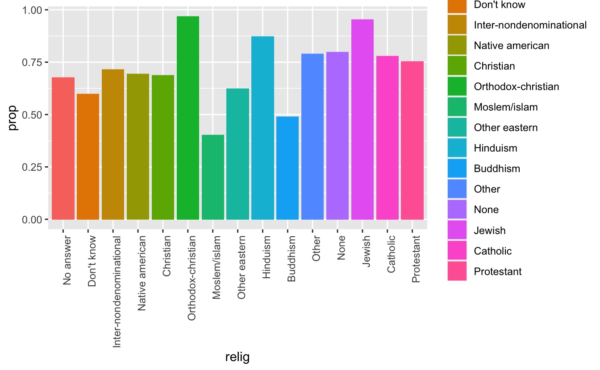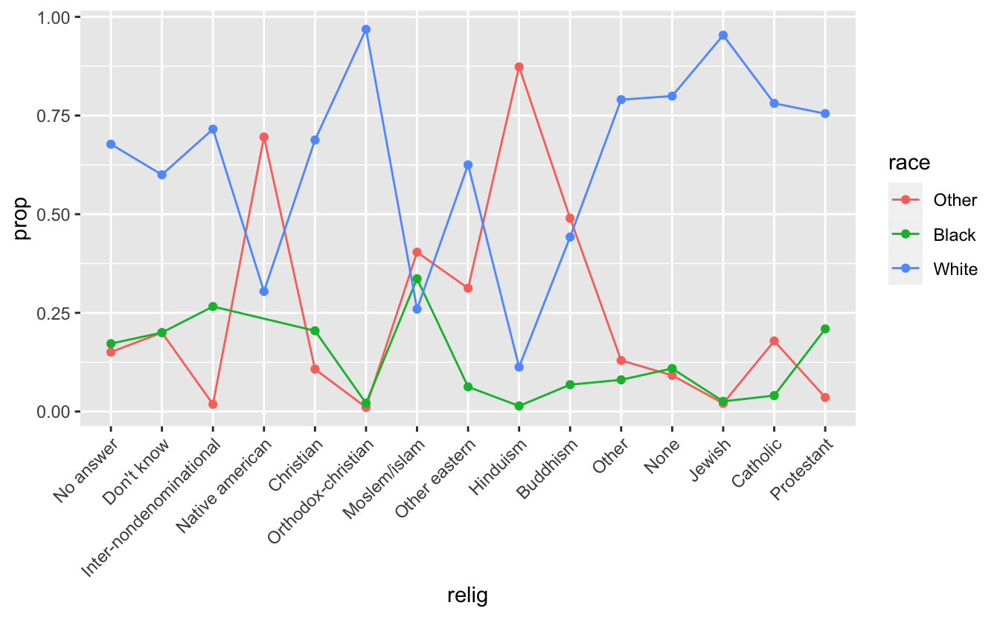
