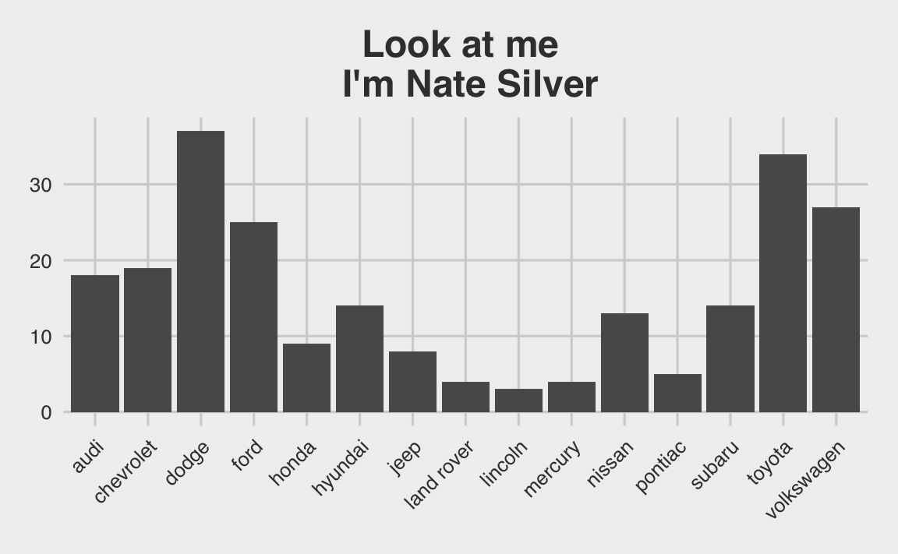
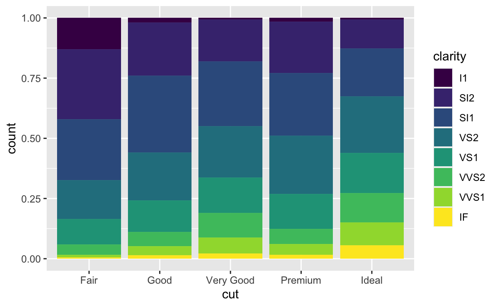

# Visualization with ggplot2
>“...few people will appreciate the music if I just show them the notes. Most of us need to listen to the music to understand how beautiful it is. But often that's how we present statistics; we just show the notes we don't play the music.” 
><div style="text-align: right">
> --- Hans Rosling </div>

>“At their best, visualizations of data effortlessly reveal the true nature of information.” 
><div style="text-align: right">
> --- Lace Padilla </div>

First off...

 <h4>Advanced R Challenges</h4>
 
Create a custom theme for your graphs!

```r
require(tidyverse)
#> Loading required package: tidyverse
#> ── Attaching packages ─────────────────────────────────────── tidyverse 1.3.1 ──
#> ✓ ggplot2 3.3.5     ✓ purrr   0.3.4
#> ✓ tibble  3.1.6     ✓ dplyr   1.0.7
#> ✓ tidyr   1.1.3     ✓ stringr 1.4.0
#> ✓ readr   1.4.0     ✓ forcats 0.5.1
#> ── Conflicts ────────────────────────────────────────── tidyverse_conflicts() ──
#> x dplyr::filter() masks stats::filter()
#> x dplyr::lag()    masks stats::lag()
#Example 1.
my.axis.font<-theme(axis.title.x = element_text(size=18), axis.title.y = element_text(size=18),
                    axis.text.x = element_text(size=18), axis.text.y = element_text(size=18), 
                    plot.title=element_text(size=18,face="bold", hjust = .5),
                    legend.title=element_text(size=14),legend.text=element_text(size=14))

# theme_mine <- theme(...)
# example 2.
### XKCD theme
theme_xkcd2 <- theme(
  panel.background = element_rect(fill="white"), 
  axis.ticks = element_line(colour=NA),
  panel.grid = element_line(colour="white"),
  axis.text.y = element_text(colour=NA), 
  axis.text.x = element_text(colour="black"),
  text = element_text(size=16, family="Humor Sans")
)

###Jittery line###
xkcd_line <- function(x, y, color) {
  len <- length(x);
  rg <- par("usr");
  yjitter <- (rg[4] - rg[3]) / 1000;
  xjitter <- (rg[2] - rg[1]) / 1000;
  x_mod <- x + rnorm(len) * xjitter;
  y_mod <- y + rnorm(len) * yjitter;
  lines(x_mod, y_mod, col='white', lwd=10);
  lines(x_mod, y_mod, col=color, lwd=5);
}

###Off-axis###
xkcd_axis <- function() {
  rg <- par("usr");
  yaxis <- 1:100 / 100 * (rg[4] - rg[3]) + rg[3];
  xaxis <- 1:100 / 100 * (rg[2] - rg[1]) + rg[1];
  xkcd_line(1:100 * 0 + rg[1] + (rg[2]-rg[1])/100, yaxis,'black')
  xkcd_line(xaxis, 1:100 * 0 + rg[3] + (rg[4]-rg[3])/100, 'black')
}

#Now use it to  plot some graphs.
mpg %>%
  ggplot() + geom_point(aes(x = displ, y = hwy, color = class)) +
  labs(title = "My Plot") +
  my.axis.font

#Some squiggly lines:
d <- data.frame(x=1:100)
d$one <- exp(-((d$x - 50)/10)^2)
d$two <- sin(d$x/10)
plot.new()
plot.window(
  c(min(d$x),max(d$x)),
  c(min(c(d$one,d$two)),max(c(d$one,d$two))))
xkcd_axis()
xkcd_line(d$x, d$one, 'red')
xkcd_line(d$x, d$two, 'blue')
```


## Steps of Visualization {-}

Step 1: Get some data


<code>ggplot2</code> has the mpg dataset.

```r
kable(ggplot2::mpg[1,1:11])
```

<table>
 <thead>
  <tr>
   <th style="text-align:left;"> manufacturer </th>
   <th style="text-align:left;"> model </th>
   <th style="text-align:right;"> displ </th>
   <th style="text-align:right;"> year </th>
   <th style="text-align:right;"> cyl </th>
   <th style="text-align:left;"> trans </th>
   <th style="text-align:left;"> drv </th>
   <th style="text-align:right;"> cty </th>
   <th style="text-align:right;"> hwy </th>
   <th style="text-align:left;"> fl </th>
   <th style="text-align:left;"> class </th>
  </tr>
 </thead>
<tbody>
  <tr>
   <td style="text-align:left;"> audi </td>
   <td style="text-align:left;"> a4 </td>
   <td style="text-align:right;"> 1.8 </td>
   <td style="text-align:right;"> 1999 </td>
   <td style="text-align:right;"> 4 </td>
   <td style="text-align:left;"> auto(l5) </td>
   <td style="text-align:left;"> f </td>
   <td style="text-align:right;"> 18 </td>
   <td style="text-align:right;"> 29 </td>
   <td style="text-align:left;"> p </td>
   <td style="text-align:left;"> compact </td>
  </tr>
</tbody>
</table>
Let's save it to something...

```r
df <- ggplot2::mpg
```
take a look at it...

```r
View(df)
```
Also look at its dimensions up in the environment ---->
(usually it's in the upper-right corner)
or print them to the console...

```r
dim(df)
#> [1] 234  11
str(df) #what kind of classes are we dealing with?
#> tibble [234 × 11] (S3: tbl_df/tbl/data.frame)
#>  $ manufacturer: chr [1:234] "audi" "audi" "audi" "audi" ...
#>  $ model       : chr [1:234] "a4" "a4" "a4" "a4" ...
#>  $ displ       : num [1:234] 1.8 1.8 2 2 2.8 2.8 3.1 1.8 1.8 2 ...
#>  $ year        : int [1:234] 1999 1999 2008 2008 1999 1999 2008 1999 1999 2008 ...
#>  $ cyl         : int [1:234] 4 4 4 4 6 6 6 4 4 4 ...
#>  $ trans       : chr [1:234] "auto(l5)" "manual(m5)" "manual(m6)" "auto(av)" ...
#>  $ drv         : chr [1:234] "f" "f" "f" "f" ...
#>  $ cty         : int [1:234] 18 21 20 21 16 18 18 18 16 20 ...
#>  $ hwy         : int [1:234] 29 29 31 30 26 26 27 26 25 28 ...
#>  $ fl          : chr [1:234] "p" "p" "p" "p" ...
#>  $ class       : chr [1:234] "compact" "compact" "compact" "compact" ...
```
Where can I read more about this dataset?


hint:

```r
?mpg
```
You can plot this data quickly in many ways:

```r
stem(mpg$displ)
#> 
#>   The decimal point is at the |
#> 
#>   1 | 6666688888888888888999
#>   2 | 0000000000000000000002222224444444444444
#>   2 | 55555555555555555555777777778888888888
#>   3 | 000000001111113333333334444
#>   3 | 555556677788888888999
#>   4 | 00000000000000022224
#>   4 | 6666666666677777777777777777
#>   5 | 002222233333344444444
#>   5 | 67777777799
#>   6 | 0122
#>   6 | 5
#>   7 | 0
hist(mpg$displ)
plot(mpg$displ)
plot(mpg$cty, mpg$hwy)
```


However, the ggplot package offers a structure and flexibility to create
almost any plot you can imagine. Other packages work with ggplot to
create the rest.

## ggplot2
Remember this scaffolding for your ggplots:

```r
ggplot(data = <DATA>) +
  <GEOM_FUNCTION>(
    mapping = aes(<MAPPINGS>),
    stat = <STAT>,
    position = <POSITION>
  ) +
  <COORDINATE_FUNCTION> +
  <FACET_FUNCTION>
```
ggplot consists of a data.frame (or a tibble), a coordinate system,
and geoms (marks that represent data values)

This is usually how we start:

```r
df %>% #the tibble
  ggplot(mapping = aes(x = displ, y = hwy)) + #the x and y coordinates (what goes on the axes)
  geom_point() #marks that represent the data values
```


You can do the same with qplot(), which is short for quick plot...


```r
qplot(x = displ, y = hwy, data = df, geom = "point")
```


**Challenge 1**
What does "displ" mean? What does "hwy" mean? What is the relationship between these variables? 

Some geoms summarize data or provide trends. For example, <code>geom_smooth()</code> plots the relationship between two variables as smoothed conditional means.


```r
df %>%
  ggplot(aes(displ, hwy)) + 
  geom_point() + 
  geom_smooth()
#> `geom_smooth()` using method = 'loess' and formula 'y ~ x'
```


Remember, this is equivalent to the example written above...

```r
ggplot(data = df, mapping = aes(x = displ, y = hwy)) + 
  geom_smooth() + geom_point()
#> `geom_smooth()` using method = 'loess' and formula 'y ~ x'
```


We can get some useful information out of this plot, like cars that don't follow the trend.


```r
ggplot(data = df, mapping = aes(x = displ, y = hwy)) + 
  geom_point(aes(color = displ > 5 & hwy > 20)) + geom_smooth()
#> `geom_smooth()` using method = 'loess' and formula 'y ~ x'
```


These cars don't follow the trend, getting higher mpg with bigger engines. We can identify these cars in the data.frame...

**Challenge 2**
Get the cars that were identified in blue and print the data.frame (tibble)

```r
View(df %>%
  filter(displ > 5 & hwy > 20))
#> Warning in system2("/usr/bin/otool", c("-L", shQuote(DSO)), stdout = TRUE):
#> running command ''/usr/bin/otool' -L '/Library/Frameworks/R.framework/Resources/
#> modules/R_de.so'' had status 1
```

All of these cars have an "fl" of "p". What does that mean? 
How would you find out?

```r
unique(df$fl)
#> [1] "p" "r" "e" "d" "c"

ggplot(mpg, aes(x=fl, y=hwy)) + geom_boxplot() + facet_wrap(~cyl, nrow=1)
```


You can add a third variable, like class, to a two dimensional scatterplot by mapping it to an aesthetic. An aesthetic is a visual property of the objects in your plot.Aesthetics include things like the size, the shape, or the color of your points. You can display a point in 
different ways by changing the values of its aesthetic properties.


```r
ggplot(data = df) + 
  geom_point(mapping = aes(x = displ, y = hwy, color = class))
```


Notice that a legend is automatically created.
Grouping variables, such as color, might include:

position (i.e., on the x and y axes)
color (“outside” color)
fill (“inside” color)
shape (of points)
linetype
size

## Linetypes

Here are the linetypes

```r
generateRLineTypes<-function(){
  oldPar<-par()
  par(font=2, mar=c(0,0,0,0))
  plot(1, pch="", ylim=c(0,6), xlim=c(0,0.7),  axes=FALSE,xlab="", ylab="")
  for(i in 0:6) lines(c(0.3,0.7), c(i,i), lty=i, lwd=3)
  text(rep(0.1,6), 0:6, labels=c("0.'blank'", "1.'solid'", "2.'dashed'", "3.'dotted'",
                                 "4.'dotdash'", "5.'longdash'", "6.'twodash'"))
  par(mar=oldPar$mar,font=oldPar$font )
}
generateRLineTypes()
```


## Symbols

Here's an example of symbols and their numbers

```r
d <- data.frame(p=c(0:25,32:127))
ggplot() +
  scale_y_continuous(name="") +
  scale_x_continuous(name="") +
  scale_shape_identity() +
  geom_point(data=d, mapping=aes(x=p%%16, y=p%/%16, shape=p), size=5, fill="red") +
  geom_text(data=d, mapping=aes(x=p%%16, y=p%/%16+0.25, label=p), size=3)
```


There are 32 quickly referenced geoms, including:

geom_abline   
geom_blank    
geom_errorbar   
geom_errorbarh    
geom_hline    
geom_jitter   
geom_linerange    
geom_point    
geom_pointrange   
geom_polygon    
geom_rect   
geom_rug    
geom_segment    
geom_step   
geom_text   
geom_vline    

See them all here: http://sape.inf.usi.ch/quick-reference/ggplot2/geom

Try them now.

```r
df %>%
  ggplot(aes(x = displ, y = hwy)) + 
  geom_line(aes(linetype = class)) + geom_point(aes(color = class))
```


**Challenge 3**
What happens if you move the grouping aesthetic "color = class" to the ggplot() function? Why?    

Try it:

```r
df %>%
  ggplot(...) + geom_line() + geom_point()
```


## Play time
Keep in mind which geoms you would like to apply to your data.

```r
load("data/eyedata.RData")

# View(df)

df %>%
  mutate(dif = Stop - Start) %>%
  group_by(Participant) %>%
  ggplot(aes(x = Participant, y = dif, group = Participant)) + 
  geom_boxplot()
#> Warning: Removed 2 rows containing non-finite values (stat_boxplot).

df <- mpg

df %>%
  ggplot(aes(x = displ, y = hwy)) + geom_bin2d()

df %>% 
  ggplot(aes(x = manufacturer)) + 
  stat_count() + 
  theme(axis.text.x = element_text(angle = 45, hjust = 1))
```


If you really want to create some ridiculous plots...

```r
#install.packages("ggthemes")
#install.packages("xkcd")
require(ggthemes)
#> Loading required package: ggthemes
require(xkcd)
#> Loading required package: xkcd
#> Loading required package: extrafont
#> Registering fonts with R

if( 'xkcd' %in% fonts()) {
p <- ggplot() + geom_point(aes(x=mpg, y=wt), data=mtcars) +
  theme(text = element_text(size = 16, family = "xkcd"))
} else {
  warning("No xkcd fonts installed!")
  p <- ggplot() + geom_point(aes(x=mpg, y=wt), data=mtcars)
  }
#> Warning: No xkcd fonts installed!
p
### How to get it (I wouldn't mess with this unless you know about installing fonts) ###
# download.file("http://simonsoftware.se/other/xkcd.ttf",dest="xkcd.ttf", mode="wb")
# system("mkdir ~/.fonts")
# system("cp ~/.fonts/xkcd.ttf")
# font_import(pattern = "xkcd", prompt=FALSE)
# fonts()
# fonttable()
# 
# if(.Platform$OS.type != "unix") {
#    ## Register fonts for Windows bitmap output
#      loadfonts(device="pdf")
#    } else {
#     loadfonts()
#     }


#### All of the code below should work unless it's xkcd related and you haven't
#### installed the fonts.

df %>%
  ggplot(aes(x = manufacturer)) + 
  stat_count() + theme_fivethirtyeight() + #fivethirtyeight theme
  labs(title = "Look at me \n I'm Nate Silver") +
  theme(axis.text.x = element_text(angle = 45, hjust = 1),
        plot.title = element_text(hjust = .5))


df %>% 
  ggplot(aes(x = manufacturer)) + 
  stat_count(fill = "#D4E8E7") + theme_tufte() +
  labs(title = "...or Edward Tufte") +
  theme(axis.text.x = element_text(angle = 45, hjust = 1),
        plot.title = element_text(hjust = .5))


df %>% 
  ggplot(aes(x = manufacturer)) + 
  stat_count(position = position_jitter(h = 0.0005), fill = "grey") + 
  theme_xkcd() +
  labs(title = "Now I'm Randall Munroe") +
  theme(axis.text.x = element_text(angle = 45, hjust = 1),
        plot.title = element_text(hjust = .5))
#> Warning in theme_xkcd(): Not xkcd fonts installed! See vignette("xkcd-intro")

df %>%
  ggplot(aes(x = displ, y = hwy, color = class)) +
  theme_xkcd() + 
  labs(title = "Because who needs \n to interpret your plots?") +
  geom_point(aes(size = cyl),
             alpha = .5) + 
  theme(plot.title = element_text(hjust = .5))
#> Warning in theme_xkcd(): Not xkcd fonts installed! See vignette("xkcd-intro")
```


Now for serious plots


**Challenge 4**

```r
ggplot(data = df) + 
  geom_point(mapping = aes(x = displ, y = hwy, color = "blue"))
```


Why are the dots not blue?


facet_wrap can create multiple plots based on levels of a factor (column)...

```r
ggplot(data = df) + 
  geom_point(mapping = aes(x = displ, y = hwy)) + 
  facet_wrap(~ class, nrow = 2)
```


facet_grid takes slightly different arguments, and facets the plot on two variables...

```r
ggplot(data = df) + 
  geom_point(mapping = aes(x = displ, y = hwy)) + 
  facet_grid(drv ~ cyl)
```


If you prefer to not facet in the rows or columns dimension, use a . instead of a variable name, e.g. + facet_grid(. ~ cyl).

...facet on a continuous variable?

```r
ggplot(data = df) + 
  geom_point(mapping = aes(x = class, y = hwy)) + 
  facet_wrap(~cty)
```


**Challenge 5**   
What plots does the following code make? What does . do?

```r
ggplot(data = df) + 
  geom_point(mapping = aes(x = displ, y = hwy)) +
  facet_grid(drv ~ .)
```


hint: try switching the . and drv


You can group by color, shape, linetype, etc. or facet, but you can also apply geoms to only a subset of the data. Below, our smooth line displays just a subset of the mpg dataset, the subcompact cars. The local data argument in geom_smooth() overrides the global data argument in ggplot() for that layer only.


```r
ggplot(data = df, mapping = aes(x = displ, y = hwy)) + 
  geom_point(mapping = aes(color = class)) + 
  geom_smooth(data = filter(mpg, class == "pickup"), se = FALSE)
#> `geom_smooth()` using method = 'loess' and formula 'y ~ x'
```


Notice how we used the filter function in the geom function?


## Statistical Transformations
Let's get a new dataset:

```r
df <- ggplot2::diamonds
```
Look in the usual places for information on your diamonds datset.

```r
ggplot(data = df) + 
  geom_bar(mapping = aes(x = cut)) + 
  theme_classic()
```


In this case, the geom_bar function has a "count" statistic. <code>count</code> is the default statistic for <code>geom_bar()</code> You can change it

```r
ggplot(data = df) + 
  geom_bar(mapping = aes(x = cut),stat = "density") + 
  theme_classic()
```


...but it doesn't make sense because we have a categorical variable on the x-axis. Remember...

```r
?geom_bar
```
We can also do the counting beforehand and then plot with the "identity" statistic...

```r
df %>%
  group_by(cut) %>%
  count() 
#> # A tibble: 5 × 2
#> # Groups:   cut [5]
#>   cut           n
#>   <ord>     <int>
#> 1 Fair       1610
#> 2 Good       4906
#> 3 Very Good 12082
#> 4 Premium   13791
#> 5 Ideal     21551
```

```r
df %>%
  group_by(cut) %>%
  count() %>%
  ggplot() + geom_bar(mapping = aes(x = cut, y = n),stat = "identity") +
  theme_classic()
```


Now we had to specify the y value because that is how high the bar should be.

We can also use geom_point with stat = "identity", which usually creates scatterplots


```r
df %>%
  group_by(cut) %>%
  count() %>%
  ggplot() + geom_point(mapping = aes(x = cut, y = n),stat = "identity") +
  theme_classic()
```


Here's a cool trick, we can use proportion in the argument to get fractions of the whole:

```r
ggplot(data = df) + 
  geom_bar(mapping = aes(x = cut, y = ..prop.., group = 1))
```


Notice that we had to specify the computed variable in dots .."stat"..

```r
ggplot(data = df) + 
  geom_bar(mapping = aes(x = cut, y = ..count.., group = 1))
```


also you have to specify that the proportion is out of a group of 1 and not cut. Otherwise they would all be a proportion of 1 for their group.

We can do this before in the data.frame as well:

```r
df %>%
  group_by(cut) %>%
  count() %>%
  ungroup() %>%
  mutate(prop = n/sum(n)) %>%
  ggplot() + geom_bar(aes(x = cut, y = prop), stat = "identity")
```


You can get summary stats inside ggplot with stat_summary:


```r
ggplot(data = df) + 
  stat_summary(
    mapping = aes(x = cut, y = depth),
    fun.ymin = min,
    fun.ymax = max,
    fun.y = median
  )
#> Warning: `fun.y` is deprecated. Use `fun` instead.
#> Warning: `fun.ymin` is deprecated. Use `fun.min` instead.
#> Warning: `fun.ymax` is deprecated. Use `fun.max` instead.
```


## Changing the position
We can also fill, stack, dodge and jitter our geoms:

```r
ggplot(data = df) + 
  geom_bar(mapping = aes(x = cut, colour = cut)) #color is the outside
ggplot(data = df) + 
  geom_bar(mapping = aes(x = cut, fill = cut)) #fill is the inside

ggplot(data = df) + 
  geom_bar(mapping = aes(x = cut, fill = clarity)) #fill by a group NOT on the x axis
```


Remember colorBrewer?

```r
require(RColorBrewer)
#> Loading required package: RColorBrewer
ggplot(data = df) + 
  geom_bar(mapping = aes(x = cut, fill = clarity)) + 
  scale_fill_brewer(palette = 4) + theme_bw()
```


The stacking is performed automatically by the position adjustment specified by the position argument. If you don’t want a stacked bar chart, you can use one of three other options: "identity", "dodge" or "fill".

position = "identity" will place each object exactly where it falls in the context of the graph. 
This is not very useful for bars, because it overlaps them. To see that overlapping we either need to make the bars slightly transparent by setting alpha to a small value, or completely transparent by setting fill = NA.

```r
ggplot(data = df, mapping = aes(x = cut, fill = clarity)) + 
  geom_bar(alpha = 1/5, position = "identity")
ggplot(data = df, mapping = aes(x = cut, colour = clarity)) + 
  geom_bar(fill = NA, position = "identity") + theme_classic()
```


The identity position adjustment is more useful for 2d geoms, like points, where it is the default.

position = "fill" works like stacking, but makes each set of stacked bars the same height. 
This makes it easier to compare proportions across groups.

```r
ggplot(data = df) + 
  geom_bar(mapping = aes(x = cut, fill = clarity), position = "fill")
```


position = "dodge" places overlapping objects directly beside one another. 
This makes it easier to compare individual values.

```r
ggplot(data = df) + 
  geom_bar(mapping = aes(x = cut, fill = clarity), position = "dodge") +
  theme_minimal()

ggplot(data = df, aes(x = price, y = carat)) +
  geom_point(position = "jitter") + theme_light() #position jitter adds randomness
```


There are packages that deal with overplotting, but some geoms make this easy as well.

```r
mprice <- df %>%
  group_by(cut,round(carat, 0)) %>%
  summarise(mprice = mean(price))
#> `summarise()` has grouped output by 'cut'. You can override using the `.groups`
#> argument.

ggplot(data = df, aes(x = price, y = carat)) +
  geom_bin2d() 

ggplot(data = df, aes(x = price, y = carat)) +
  geom_density2d() + theme_classic()
```


## Coordinates

```r
ggplot(df, aes(x = cut, y = depth)) + geom_boxplot()

ggplot(df, aes(x = cut, y = depth)) + 
  geom_boxplot() +
  coord_flip()
```


### Plot maps if you want

```r
# install.packages("maps")
require(maps)
#> Loading required package: maps
#> 
#> Attaching package: 'maps'
#> The following object is masked from 'package:purrr':
#> 
#>     map
globe <- map_data(map = "world")

ggplot(globe, aes(long, lat, group = group)) +
  geom_polygon(fill = "white", colour = "black")

unique(globe$region)[1:10]
#>  [1] "Aruba"                "Afghanistan"          "Angola"              
#>  [4] "Anguilla"             "Albania"              "Finland"             
#>  [7] "Andorra"              "United Arab Emirates" "Argentina"           
#> [10] "Armenia"

newplaces <- map_data(map = "world", region = "Vanuatu")

ggplot(newplaces, aes(long, lat, group = group)) +
  geom_polygon(fill = "white", colour = "black") +
  coord_quickmap() #This adds lat and long
```


Plot with flipped axes or in polar coordinates...

```r
bar <- ggplot(data = df) + 
  geom_bar(
    mapping = aes(x = cut, fill = cut), 
    show.legend = FALSE,
    width = 1
  ) + 
  theme(aspect.ratio = 1) +
  labs(x = NULL, y = NULL)

bar + coord_flip()
bar + coord_polar()
```


So much you can do!

