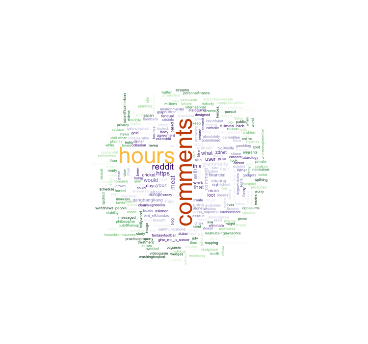

# Introduction to Statistics 
>"An approximate answer to the right problem is worth a good deal more than an exact answer to an approximate problem." 
><div style="text-align: right">
> --- John Tukey </div>

>"To call in the statistician after the experiment is done may be no more than asking him to perform a post-mortem examination: he may be able to say what the experiment died of."
><div style="text-align: right">
> --- Ronald Fisher</div>

First off...

 <h4>Advanced R Challenges</h4>
 
This challenge doesn't have much to do with stats. It's just a fun way to vizualize work you have done. Get the documents from your publications or research papers and visualize them in a word cloud. Here's an example:

```r
# Wordl Challenge ---------------------------------------------------------
#Create a visual word cloud from a manuscript or publication from your own work.
library(tidyverse) #Load the tidyverse
library(textreadr) #Load the package 'textreadr'


rawtext <- read_docx("path/to/your/file.docx") #Read a word file .doc or .docx and save it to rawtext
rawtext <- read_document("path/to/your/file.pdf") #Read a pdf and save it to rawtext

words.l <- strsplit(rawdata,"\\W") #Split the word strings on the whitespace into lists
text1 <-unlist(words.l) #Turn the list into a vector of characters
d<-as.data.frame(text1) #Save text vector as a data.frame

density<- d %>% #Using dplyr and magritr, go into your data.frame with %>%
  mutate(text1 = tolower(as.character(text1))) %>% #Make all words lowercase
  filter(text1 != "", text1 != grepl("[[:digit:]]+",text1)) %>% #Remove numbers and blanks
  group_by(text1) %>% #Group the data by unique each word
  summarize(count = n()) %>% #Count the number of words of each kind there are
  filter(!grepl("[[:digit:]]+",text1), nchar(text1) > 4) %>% #Filter out words with very few characters
  arrange(desc(count)) #Arrange from highest to lowest

#install.packages("wordcloud")
#install.packages("RcolorBrewer")
require('wordcloud') #Get the wordcloud package
require('RColorBrewer')
pal2 <- brewer.pal(8,"Dark2") #Create a brewer pallete ... see ?
png("ModelingCognitiveWorkload.png", width=750,height=600) #Open a png file to write into
#call wordcloud within the png file, you could also call wordcloud outside of the png file
wordcloud(density$text1, density$count, scale=c(4,.5),min.freq=1,max.words=Inf, random.order=FALSE, rot.per=.15, colors=pal2)
dev.off() #close the png file
```

#Stats {-}

Wordl Website

```r
library(rvest)
library(tidyverse)
html_reddit <- read_html("https://www.reddit.com/")

words.l <- html_reddit %>%
  html_nodes("a") %>%
  html_text()
  
text1 <- unlist(strsplit(words.l,"\\W"))

d<-as.data.frame(text1)

density<- d %>%
  mutate(text1 = tolower(as.character(text1))) %>%
  filter(text1 != "", text1 != grepl("[[:digit:]]+",text1)) %>%
  group_by(text1) %>%
  summarize(count = n()) %>%
  filter(!grepl("[[:digit:]]+",text1), nchar(text1) > 3) %>%
  arrange(desc(count))

require('wordcloud')
require('RColorBrewer')
pal2 <- rev(c(rep(brewer.pal(n = 9, "Greens"),15),rep(brewer.pal(n = 8, "Purples"),16),
              "#FEC44F","#CC4C02"))
png("wordcloud_reddit.png", width=750,height=700)
wordcloud(density$text1, density$count, scale=c(4,.5),min.freq=1,max.words=Inf, 
          random.order=F, rot.per=.15, colors=pal2,ordered.colors = T)
dev.off()
```




```r
rm(list = ls());par(mfrow = c(1,1))
require(tidyverse)
#> Loading required package: tidyverse
#> -- Attaching packages ---------------------------------------------------- tidyverse 1.3.0 --
#> v ggplot2 3.2.1     v purrr   0.3.3
#> v tibble  2.1.3     v dplyr   0.8.4
#> v tidyr   1.0.2     v stringr 1.4.0
#> v readr   1.3.1     v forcats 0.5.0
#> -- Conflicts ------------------------------------------------------- tidyverse_conflicts() --
#> x dplyr::filter() masks stats::filter()
#> x dplyr::lag()    masks stats::lag()
#install.packages("lsr")
```

##Steps of Visualization

From Navarro, Page 105...

### Descriptive Stats

```r
load("~/Dropbox/RCOURSE/books_resources/data/aflsmall.Rdata")
library(lsr)
lsr::who()
#>    -- Name --      -- Class --   -- Size --
#>    afl.finalists   factor        400       
#>    afl.margins     numeric       176
```

The afl.margins variable contains the winning margin (number of points) for all 176 home and away games played during the 2010 season.

Quick Afl rules:
There are 4 posts, to score:
- Goal (through the two middle posts): 6 points
- Behind (through the outside posts): 1 point
- Ball touched (through any sets of posts): 1 point
- Hits one of the middle posts: 1 point

(Scores are high as you will see)

Here's a vector of winner-loser scores for 176 games in 2010 afl.margins

Let's make sense of this mess.

```r
hist(afl.margins, breaks=10)
stem(afl.margins)
#> 
#>   The decimal point is 1 digit(s) to the right of the |
#> 
#>    0 | 001111223333333344567788888999999
#>    1 | 0000011122234456666899999
#>    2 | 00011222333445566667788999999
#>    3 | 01223555566666678888899
#>    4 | 012334444477788899
#>    5 | 00002233445556667
#>    6 | 0113455678
#>    7 | 01123556
#>    8 | 122349
#>    9 | 458
#>   10 | 148
#>   11 | 6
```


\begin{center}\includegraphics[width=0.7\linewidth]{06_IntroStats_files/figure-latex/histstem-1} \end{center}

### Measures of Central Tendency
mean calculation

```r
sum(afl.margins)/length(afl.margins)
#> [1] 35.3
```
OR

```r
mean(afl.margins)
#> [1] 35.3
```

**Challenge 1**
Get the mean of the first five game margins.

**Challenge 2**
Get the median game margin.


Great metaphor for the two: The mean is basically the “centre of gravity” of the data set. If you imagine that the histogram of the data is a solid object, then the point on which you could balance it (as if on a see-saw) is the mean. In contrast, the median is the middle observation. Half of the observations are smaller, and half of the observations are larger.

You can trim the mean:

```r
mean( x = afl.margins, trim = .05) #Trims 5% of the data off either side
#> [1] 33.8

.05*176 #How many scores are trimmed total
#> [1] 8.8
```
Get the Mode

```r
mode(afl.margins)
#> [1] "numeric"
```
You can create the function from just doing the math.

```r
getmode <- function(v) {
  uniqv <- unique(v)
  uniqv[which.max(tabulate(match(v, uniqv)))]
}

getmode(afl.margins)
#> [1] 3
```
Mode on a character vector?

```r
lsr::modeOf(afl.finalists)
#> [1] "Geelong"
table(afl.finalists)
#> afl.finalists
#>         Adelaide         Brisbane          Carlton      Collingwood 
#>               26               25               26               28 
#>         Essendon          Fitzroy        Fremantle          Geelong 
#>               32                0                6               39 
#>         Hawthorn        Melbourne  North Melbourne    Port Adelaide 
#>               27               28               28               17 
#>         Richmond         St Kilda           Sydney       West Coast 
#>                6               24               26               38 
#> Western Bulldogs 
#>               24
```
How often does the mode occur?

```r
maxFreq( x = afl.finalists )
#> [1] 39
```
### Measures of Variability


```r
max(afl.margins)
#> [1] 116
min(afl.margins)
#> [1] 0
range( afl.margins )
#> [1]   0 116
quantile( x = afl.margins, probs = .5)
#>  50% 
#> 30.5
quantile(afl.margins, probs = c(.25,.5,.75))
#>  25%  50%  75% 
#> 12.8 30.5 50.5
IQR( x = afl.margins ) # Inter-quartile range
#> [1] 37.8
```
OR

```r
quantile(afl.margins, probs = .75) - quantile(afl.margins, probs = .25)
#>  75% 
#> 37.8
```
Mean absolute deviation

```r
lsr::aad(afl.margins)
#> [1] 21.1
```
what does aad do?   

hint:

```r
aad #You can look into functions by not adding the ()
#> function (x, na.rm = FALSE) 
#> {
#>     if (!is(x, "numeric") & !is(x, "integer")) {
#>         stop("\"x\" must be numeric")
#>     }
#>     if (!is(na.rm, "logical") | length(na.rm) != 1) {
#>         stop("\"na.rm\" must be a single logical value")
#>     }
#>     if (na.rm) {
#>         x <- x[!is.na(x)]
#>     }
#>     y <- mean(abs(x - mean(x)))
#>     return(y)
#> }
#> <bytecode: 0x7fe8b7092828>
#> <environment: namespace:lsr>
```

```r
mean(abs(afl.margins - mean(afl.margins)))
#> [1] 21.1
```
Variance (mean squared deviation)

```r
mean( (afl.margins - mean(afl.margins) )^2)
#> [1] 676
var(afl.margins)
#> [1] 680
sd(afl.margins)
#> [1] 26.1
```

**Challenge 3** Show the standard deviation in a graph.   


**Challenge 4** Calculate histogram, but do not draw it.


Skew and kurtosis from psych library

```r
library(psych)
#> 
#> Attaching package: 'psych'
#> The following objects are masked from 'package:ggplot2':
#> 
#>     %+%, alpha
skew(afl.margins)
#> [1] 0.767
kurtosi(afl.margins)
#> [1] 0.0296
```


```r
q <- rbind(c("too flat", "platykurtic", "negative"),
      rbind(c("just pointy enough", "mesokurtic", "zero"),
c("too pointy", "leptokurtic", "positive")))
colnames(q) <- c("informal term", "technical name", "kurtosis value")
data.frame(q)

#        informal.term technical.name kurtosis.value
# 1           too flat    platykurtic       negative
# 2 just pointy enough     mesokurtic           zero
# 3         too pointy    leptokurtic       positive
```

Get it all

```r
describe(afl.margins)
#>    vars   n mean   sd median trimmed  mad min max range skew kurtosis   se
#> X1    1 176 35.3 26.1   30.5    32.8 28.9   0 116   116 0.77     0.03 1.97
```
## Clinical Trial Example

```r
#New dataset
load("~/Dropbox/RCOURSE/books_resources/data/clinicaltrial.Rdata")
psych::describe(clin.trial)
#>           vars  n mean   sd median trimmed  mad min max range skew kurtosis
#> drug*        1 18 2.00 0.84   2.00    2.00 1.48 1.0 3.0   2.0 0.00    -1.66
#> therapy*     2 18 1.50 0.51   1.50    1.50 0.74 1.0 2.0   1.0 0.00    -2.11
#> mood.gain    3 18 0.88 0.53   0.85    0.88 0.67 0.1 1.8   1.7 0.13    -1.44
#>             se
#> drug*     0.20
#> therapy*  0.12
#> mood.gain 0.13

describeBy(clin.trial, group = c("drug","therapy"))
#> 
#>  Descriptive statistics by group 
#> drug: placebo
#> therapy: no.therapy
#>           vars n mean  sd median trimmed mad min max range skew kurtosis   se
#> drug*        1 3  1.0 0.0    1.0     1.0 0.0 1.0 1.0   0.0  NaN      NaN 0.00
#> therapy*     2 3  1.0 0.0    1.0     1.0 0.0 1.0 1.0   0.0  NaN      NaN 0.00
#> mood.gain    3 3  0.3 0.2    0.3     0.3 0.3 0.1 0.5   0.4    0    -2.33 0.12
#> ------------------------------------------------------------ 
#> drug: anxifree
#> therapy: no.therapy
#>           vars n mean  sd median trimmed mad min max range skew kurtosis   se
#> drug*        1 3  2.0 0.0    2.0     2.0 0.0 2.0 2.0   0.0  NaN      NaN 0.00
#> therapy*     2 3  1.0 0.0    1.0     1.0 0.0 1.0 1.0   0.0  NaN      NaN 0.00
#> mood.gain    3 3  0.4 0.2    0.4     0.4 0.3 0.2 0.6   0.4    0    -2.33 0.12
#> ------------------------------------------------------------ 
#> drug: joyzepam
#> therapy: no.therapy
#>           vars n mean   sd median trimmed  mad min max range skew kurtosis   se
#> drug*        1 3 3.00 0.00    3.0    3.00 0.00 3.0 3.0   0.0  NaN      NaN 0.00
#> therapy*     2 3 1.00 0.00    1.0    1.00 0.00 1.0 1.0   0.0  NaN      NaN 0.00
#> mood.gain    3 3 1.47 0.21    1.4    1.47 0.15 1.3 1.7   0.4 0.29    -2.33 0.12
#> ------------------------------------------------------------ 
#> drug: placebo
#> therapy: CBT
#>           vars n mean  sd median trimmed  mad min max range skew kurtosis   se
#> drug*        1 3  1.0 0.0    1.0     1.0 0.00 1.0 1.0   0.0  NaN      NaN 0.00
#> therapy*     2 3  2.0 0.0    2.0     2.0 0.00 2.0 2.0   0.0  NaN      NaN 0.00
#> mood.gain    3 3  0.6 0.3    0.6     0.6 0.44 0.3 0.9   0.6    0    -2.33 0.17
#> ------------------------------------------------------------ 
#> drug: anxifree
#> therapy: CBT
#>           vars n mean   sd median trimmed  mad min max range  skew kurtosis
#> drug*        1 3 2.00 0.00    2.0    2.00 0.00 2.0 2.0   0.0   NaN      NaN
#> therapy*     2 3 2.00 0.00    2.0    2.00 0.00 2.0 2.0   0.0   NaN      NaN
#> mood.gain    3 3 1.03 0.21    1.1    1.03 0.15 0.8 1.2   0.4 -0.29    -2.33
#>             se
#> drug*     0.00
#> therapy*  0.00
#> mood.gain 0.12
#> ------------------------------------------------------------ 
#> drug: joyzepam
#> therapy: CBT
#>           vars n mean   sd median trimmed  mad min max range skew kurtosis   se
#> drug*        1 3  3.0 0.00    3.0     3.0 0.00 3.0 3.0   0.0  NaN      NaN 0.00
#> therapy*     2 3  2.0 0.00    2.0     2.0 0.00 2.0 2.0   0.0  NaN      NaN 0.00
#> mood.gain    3 3  1.5 0.26    1.4     1.5 0.15 1.3 1.8   0.5 0.32    -2.33 0.15

by(data = clin.trial, INDICES = clin.trial$therapy, FUN = describe)
#> clin.trial$therapy: no.therapy
#>           vars n mean   sd median trimmed  mad min max range skew kurtosis   se
#> drug*        1 9 2.00 0.87    2.0    2.00 1.48 1.0 3.0   2.0 0.00    -1.81 0.29
#> therapy*     2 9 1.00 0.00    1.0    1.00 0.00 1.0 1.0   0.0  NaN      NaN 0.00
#> mood.gain    3 9 0.72 0.59    0.5    0.72 0.44 0.1 1.7   1.6 0.51    -1.59 0.20
#> ------------------------------------------------------------ 
#> clin.trial$therapy: CBT
#>           vars n mean   sd median trimmed  mad min max range  skew kurtosis
#> drug*        1 9 2.00 0.87    2.0    2.00 1.48 1.0 3.0   2.0  0.00    -1.81
#> therapy*     2 9 2.00 0.00    2.0    2.00 0.00 2.0 2.0   0.0   NaN      NaN
#> mood.gain    3 9 1.04 0.45    1.1    1.04 0.44 0.3 1.8   1.5 -0.03    -1.12
#>             se
#> drug*     0.29
#> therapy*  0.00
#> mood.gain 0.15
by(data = clin.trial, INDICES = clin.trial$therapy, FUN = summary)
#> clin.trial$therapy: no.therapy
#>        drug         therapy    mood.gain    
#>  placebo :3   no.therapy:9   Min.   :0.100  
#>  anxifree:3   CBT       :0   1st Qu.:0.300  
#>  joyzepam:3                  Median :0.500  
#>                              Mean   :0.722  
#>                              3rd Qu.:1.300  
#>                              Max.   :1.700  
#> ------------------------------------------------------------ 
#> clin.trial$therapy: CBT
#>        drug         therapy    mood.gain   
#>  placebo :3   no.therapy:0   Min.   :0.30  
#>  anxifree:3   CBT       :9   1st Qu.:0.80  
#>  joyzepam:3                  Median :1.10  
#>                              Mean   :1.04  
#>                              3rd Qu.:1.30  
#>                              Max.   :1.80
```

##Correlations
Here is an example of correlations with the mtcars dataset from <code>datasets</code>.

```r
df <- datasets::mtcars
cor(mtcars$mpg, mtcars$disp)
#> [1] -0.848

plot(mtcars$mpg, mtcars$disp)
```


\begin{center}\includegraphics[width=0.7\linewidth]{06_IntroStats_files/figure-latex/correlations-1} \end{center}

Here's the work dataset from Navarro.

```r
load("~/Dropbox/RCOURSE/books_resources/data/work.Rdata")
head(work)
#>   hours tasks pay day   weekday week day.type
#> 1   7.2    14  41   1   Tuesday    1  weekday
#> 2   7.4    11  39   2 Wednesday    1  weekday
#> 3   6.6    14  13   3  Thursday    1  weekday
#> 4   6.5    22  47   4    Friday    1  weekday
#> 5   3.1     5   4   5  Saturday    1  weekend
#> 6   3.0     7  12   6    Sunday    1  weekend
```

and here's a correlation between work hours and pay.

```r
cor(work$hours, work$pay)
#> [1] 0.76
plot(work$hours, work$pay)
lsr::correlate(work) #Gives a correlation table
#> 
#> CORRELATIONS
#> ============
#> - correlation type:  pearson 
#> - correlations shown only when both variables are numeric
#> 
#>           hours  tasks   pay    day weekday   week day.type
#> hours         .  0.800 0.760 -0.049       .  0.018        .
#> tasks     0.800      . 0.720 -0.072       . -0.013        .
#> pay       0.760  0.720     .  0.137       .  0.196        .
#> day      -0.049 -0.072 0.137      .       .  0.990        .
#> weekday       .      .     .      .       .      .        .
#> week      0.018 -0.013 0.196  0.990       .      .        .
#> day.type      .      .     .      .       .      .        .
lsr::correlate(work, corr.method = "spearman")
#> 
#> CORRELATIONS
#> ============
#> - correlation type:  spearman 
#> - correlations shown only when both variables are numeric
#> 
#>           hours  tasks   pay    day weekday   week day.type
#> hours         .  0.805 0.745 -0.047       .  0.010        .
#> tasks     0.805      . 0.730 -0.068       . -0.008        .
#> pay       0.745  0.730     .  0.094       .  0.154        .
#> day      -0.047 -0.068 0.094      .       .  0.990        .
#> weekday       .      .     .      .       .      .        .
#> week      0.010 -0.008 0.154  0.990       .      .        .
#> day.type      .      .     .      .       .      .        .
cor.test(mtcars$mpg, mtcars$disp) #For paired samples
#> 
#> 	Pearson's product-moment correlation
#> 
#> data:  mtcars$mpg and mtcars$disp
#> t = -9, df = 30, p-value = 9e-10
#> alternative hypothesis: true correlation is not equal to 0
#> 95 percent confidence interval:
#>  -0.923 -0.708
#> sample estimates:
#>    cor 
#> -0.848
```


\begin{center}\includegraphics[width=0.7\linewidth]{06_IntroStats_files/figure-latex/workcors-1} \end{center}
## Categorical Data -- Navarro pg. 351

### Chi Square goodness-of-fit test (Pearson, 1900) Review

```r
load("~/Dropbox/RCOURSE/books_resources/data/randomness.Rdata")

head(cards)
#>      id choice_1 choice_2
#> 1 subj1   spades    clubs
#> 2 subj2 diamonds    clubs
#> 3 subj3   hearts    clubs
#> 4 subj4   spades    clubs
#> 5 subj5   hearts   spades
#> 6 subj6    clubs   hearts
observed <- table(cards$choice_1)
observed
#> 
#>    clubs diamonds   hearts   spades 
#>       35       51       64       50
```
H0 - all four suits are chosen with equal probability   
H1 - at least one of the suit-choice probabilities isn't .25    


```r
probabilities <- c(clubs = .25, diamonds = .25, hearts = .25, spades = .25)
probabilities
#>    clubs diamonds   hearts   spades 
#>     0.25     0.25     0.25     0.25
N <- length(cards[,1])
expected <- N*probabilities #expected frequencies
expected
#>    clubs diamonds   hearts   spades 
#>       50       50       50       50

observed - expected
#> 
#>    clubs diamonds   hearts   spades 
#>      -15        1       14        0
```

Get absolute difference (no negative or positive)

```r
sum(((observed - expected)^2)/expected)
#> [1] 8.44

qchisq(p = .95, df = 3) #Gives you a value to reject the null hypothesis
#> [1] 7.81
```
If we want the p-value we can calculate with...

```r
pchisq(q = sum(((observed - expected)^2)/expected), df = 3, lower.tail = FALSE)
#> [1] 0.0377
```
Degrees of freedom is outcomes (k) - 1

How to skip all those steps:

```r
lsr::goodnessOfFitTest(cards$choice_1)
#> 
#>      Chi-square test against specified probabilities
#> 
#> Data variable:   cards$choice_1 
#> 
#> Hypotheses: 
#>    null:        true probabilities are as specified
#>    alternative: true probabilities differ from those specified
#> 
#> Descriptives: 
#>          observed freq. expected freq. specified prob.
#> clubs                35             50            0.25
#> diamonds             51             50            0.25
#> hearts               64             50            0.25
#> spades               50             50            0.25
#> 
#> Test results: 
#>    X-squared statistic:  8.44 
#>    degrees of freedom:  3 
#>    p-value:  0.038
```
Specify null hypothesis:

```r
nullProbs <- c(clubs = .2, diamonds = .3, hearts = .3, spades = .2)

goodnessOfFitTest(cards$choice_1, p = nullProbs)
#> 
#>      Chi-square test against specified probabilities
#> 
#> Data variable:   cards$choice_1 
#> 
#> Hypotheses: 
#>    null:        true probabilities are as specified
#>    alternative: true probabilities differ from those specified
#> 
#> Descriptives: 
#>          observed freq. expected freq. specified prob.
#> clubs                35             40             0.2
#> diamonds             51             60             0.3
#> hearts               64             60             0.3
#> spades               50             40             0.2
#> 
#> Test results: 
#>    X-squared statistic:  4.74 
#>    degrees of freedom:  3 
#>    p-value:  0.192
```
### Chi-square test of independence
Get the chapek9 dataset:

```r
load("~/Dropbox/RCOURSE/books_resources/data/chapek9.Rdata")
summary(chapek9)
#>   species      choice   
#>  robot:87   puppy : 28  
#>  human:93   flower: 43  
#>             data  :109
```
This is a screening test to determine of somebody is a human or a robot. The entity is asked whether they prefer a puppy, a flower, or a properly formatted database.

```r
xtabs(formula = ~choice+species, data = chapek9)
#>         species
#> choice   robot human
#>   puppy     13    15
#>   flower    30    13
#>   data      44    65
```
1. Null, variables are independent
2. Alternative, variables are related


```r
associationTest(formula = ~choice+species, data = chapek9)
#> 
#>      Chi-square test of categorical association
#> 
#> Variables:   choice, species 
#> 
#> Hypotheses: 
#>    null:        variables are independent of one another
#>    alternative: some contingency exists between variables
#> 
#> Observed contingency table:
#>         species
#> choice   robot human
#>   puppy     13    15
#>   flower    30    13
#>   data      44    65
#> 
#> Expected contingency table under the null hypothesis:
#>         species
#> choice   robot human
#>   puppy   13.5  14.5
#>   flower  20.8  22.2
#>   data    52.7  56.3
#> 
#> Test results: 
#>    X-squared statistic:  10.7 
#>    degrees of freedom:  2 
#>    p-value:  0.005 
#> 
#> Other information: 
#>    estimated effect size (Cramer's v):  0.244
```

Most typical way to do the test...

```r
chisq.test(observed, p = c(.2,.3,.3,.2))
#> 
#> 	Chi-squared test for given probabilities
#> 
#> data:  observed
#> X-squared = 5, df = 3, p-value = 0.2

chisq.test(xtabs(formula = ~choice+species, data = chapek9))
#> 
#> 	Pearson's Chi-squared test
#> 
#> data:  xtabs(formula = ~choice + species, data = chapek9)
#> X-squared = 11, df = 2, p-value = 0.005
```
(Also see <code>?fisher.test()</code>, <code>mcnemar.test()</code>)

##T.TEST
Load harpo dataset

```r
load("~/Dropbox/RCOURSE/books_resources/data/harpo.Rdata")
```
...and describe it:

```r
head(harpo)
#>   grade      tutor
#> 1    65  Anastasia
#> 2    72 Bernadette
#> 3    66 Bernadette
#> 4    74  Anastasia
#> 5    73  Anastasia
#> 6    71 Bernadette
describeBy(harpo,group = "tutor")
#> 
#>  Descriptive statistics by group 
#> group: Anastasia
#>        vars  n mean sd median trimmed mad min max range  skew kurtosis   se
#> grade     1 15 74.5  9     76    74.8 8.9  55  90    35 -0.32    -0.51 2.32
#> tutor*    2 15  1.0  0      1     1.0 0.0   1   1     0   NaN      NaN 0.00
#> ------------------------------------------------------------ 
#> group: Bernadette
#>        vars  n mean   sd median trimmed  mad min max range  skew kurtosis   se
#> grade     1 18 69.1 5.77     69    69.2 5.19  56  79    23 -0.48    -0.39 1.36
#> tutor*    2 18  2.0 0.00      2     2.0 0.00   2   2     0   NaN      NaN 0.00
```
Here's the independent samples t.test:

```r
lsr::independentSamplesTTest(formula = grade~tutor,
                             data = harpo,
                             var.equal = T)
#> 
#>    Student's independent samples t-test 
#> 
#> Outcome variable:   grade 
#> Grouping variable:  tutor 
#> 
#> Descriptive statistics: 
#>             Anastasia Bernadette
#>    mean        74.533     69.056
#>    std dev.     8.999      5.775
#> 
#> Hypotheses: 
#>    null:        population means equal for both groups
#>    alternative: different population means in each group
#> 
#> Test results: 
#>    t-statistic:  2.12 
#>    degrees of freedom:  31 
#>    p-value:  0.043 
#> 
#> Other information: 
#>    two-sided 95% confidence interval:  [0.197, 10.759] 
#>    estimated effect size (Cohen's d):  0.74
```
OR

```r
t.test(grade~tutor, data = harpo, var.equal = T, paired = F, conf.level = .95)
#> 
#> 	Two Sample t-test
#> 
#> data:  grade by tutor
#> t = 2, df = 31, p-value = 0.04
#> alternative hypothesis: true difference in means is not equal to 0
#> 95 percent confidence interval:
#>   0.197 10.759
#> sample estimates:
#>  mean in group Anastasia mean in group Bernadette 
#>                     74.5                     69.1
```

##Effect Size

```r
cohensD(grade~tutor, data = harpo, method = "pooled")
#> [1] 0.74

cohensD(grade~tutor, data = harpo, method = "unequal")
#> [1] 0.724
```
##Assumptions
Check some plots, and you can look at normality.

```r
hist(harpo$grade, breaks = 15)
qqnorm(harpo$grade)
```


\begin{center}\includegraphics[width=0.7\linewidth]{06_IntroStats_files/figure-latex/qqnorm-1} \includegraphics[width=0.7\linewidth]{06_IntroStats_files/figure-latex/qqnorm-2} \end{center}
###Shapiro normality test

```r
shapiro.test(harpo$grade)
#> 
#> 	Shapiro-Wilk normality test
#> 
#> data:  harpo$grade
#> W = 1, p-value = 1
```
Or use wilcoxon test for non-normal samples:

```r
wilcox.test(grade~tutor, data = harpo)
#> Warning in wilcox.test.default(x = c(65, 74, 73, 83, 76, 65, 86, 70, 80, :
#> cannot compute exact p-value with ties
#> 
#> 	Wilcoxon rank sum test with continuity correction
#> 
#> data:  grade by tutor
#> W = 190, p-value = 0.05
#> alternative hypothesis: true location shift is not equal to 0
```

##One-Way ANOVA
back to the clin.trial dataset

```r
aggregate(mood.gain ~drug, clin.trial, mean)
#>       drug mood.gain
#> 1  placebo     0.450
#> 2 anxifree     0.717
#> 3 joyzepam     1.483
aggregate(mood.gain ~drug, clin.trial, sd)
#>       drug mood.gain
#> 1  placebo     0.281
#> 2 anxifree     0.392
#> 3 joyzepam     0.214
```

Here's a plot of means with sd errorbars.

```r
clin.trial %>%
  group_by(drug) %>%
  summarise(m.mood = mean(mood.gain), sd.mood = sd(mood.gain)) %>%
  ggplot(aes(x = drug, y = m.mood)) + geom_point() + theme_classic() +
  coord_cartesian(ylim = c(0,2)) + 
  geom_errorbar(aes(ymax = m.mood + sd.mood, 
                    ymin = m.mood - sd.mood), width = .25)
```


\begin{center}\includegraphics[width=0.7\linewidth]{06_IntroStats_files/figure-latex/fullplot-1} \end{center}
...and now for the anova...

```r
my.anova <- aov(formula = mood.gain~drug, data = clin.trial)
```
What is this <code>my.anova</code> object?

```r
class(my.anova)
#> [1] "aov" "lm"
names(my.anova)
#>  [1] "coefficients"  "residuals"     "effects"       "rank"         
#>  [5] "fitted.values" "assign"        "qr"            "df.residual"  
#>  [9] "contrasts"     "xlevels"       "call"          "terms"        
#> [13] "model"
summary(my.anova)
#>             Df Sum Sq Mean Sq F value  Pr(>F)    
#> drug         2   3.45   1.727    18.6 8.6e-05 ***
#> Residuals   15   1.39   0.093                    
#> ---
#> Signif. codes:  0 '***' 0.001 '**' 0.01 '*' 0.05 '.' 0.1 ' ' 1
```

Here's a test of effect size for the ANOVA

```r
lsr::etaSquared(my.anova)
#>      eta.sq eta.sq.part
#> drug  0.713       0.713
```
and posthoc pairwise comparisons of levels of a factor


```r
posthocPairwiseT(my.anova, p.adjust.method = "none")
#> 
#> 	Pairwise comparisons using t tests with pooled SD 
#> 
#> data:  mood.gain and drug 
#> 
#>          placebo anxifree
#> anxifree 0.2     -       
#> joyzepam 3e-05   6e-04   
#> 
#> P value adjustment method: none
```
or corrected for assumptions

```r
posthocPairwiseT(my.anova, p.adjust.method = "bonferroni")
#> 
#> 	Pairwise comparisons using t tests with pooled SD 
#> 
#> data:  mood.gain and drug 
#> 
#>          placebo anxifree
#> anxifree 0.451   -       
#> joyzepam 9e-05   0.002   
#> 
#> P value adjustment method: bonferroni
```
and a test for homogeneity of variance from the <code>car</code> package.

```r
require(car) #Test for homogeneity of variance
#> Loading required package: car
#> Loading required package: carData
#> 
#> Attaching package: 'car'
#> The following object is masked from 'package:psych':
#> 
#>     logit
#> The following object is masked from 'package:dplyr':
#> 
#>     recode
#> The following object is masked from 'package:purrr':
#> 
#>     some
car::leveneTest(my.anova)
#> Levene's Test for Homogeneity of Variance (center = median)
#>       Df F value Pr(>F)
#> group  2    1.47   0.26
#>       15
```

##AAAANNDD Regression


```r
load("~/Dropbox/RCOURSE/books_resources/data/parenthood.Rdata")
head(parenthood)
#>   dan.sleep baby.sleep dan.grump day
#> 1      7.59      10.18        56   1
#> 2      7.91      11.66        60   2
#> 3      5.14       7.92        82   3
#> 4      7.71       9.61        55   4
#> 5      6.68       9.75        67   5
#> 6      5.99       5.04        72   6
```
Here's the linear model.

```r
regres1 <- lm(formula = dan.grump~dan.sleep, data = parenthood)
```
You can plot it and print a summary.

```r
plot(regres1)
summary(regres1)
#> 
#> Call:
#> lm(formula = dan.grump ~ dan.sleep, data = parenthood)
#> 
#> Residuals:
#>     Min      1Q  Median      3Q     Max 
#> -11.025  -2.213  -0.399   2.681  11.750 
#> 
#> Coefficients:
#>             Estimate Std. Error t value Pr(>|t|)    
#> (Intercept)  125.956      3.016    41.8   <2e-16 ***
#> dan.sleep     -8.937      0.429   -20.9   <2e-16 ***
#> ---
#> Signif. codes:  0 '***' 0.001 '**' 0.01 '*' 0.05 '.' 0.1 ' ' 1
#> 
#> Residual standard error: 4.33 on 98 degrees of freedom
#> Multiple R-squared:  0.816,	Adjusted R-squared:  0.814 
#> F-statistic:  435 on 1 and 98 DF,  p-value: <2e-16
```


\begin{center}\includegraphics[width=0.7\linewidth]{06_IntroStats_files/figure-latex/unnamed-chunk-6-1} \includegraphics[width=0.7\linewidth]{06_IntroStats_files/figure-latex/unnamed-chunk-6-2} \includegraphics[width=0.7\linewidth]{06_IntroStats_files/figure-latex/unnamed-chunk-6-3} \includegraphics[width=0.7\linewidth]{06_IntroStats_files/figure-latex/unnamed-chunk-6-4} \end{center}
Here's a model with an interaction.


```r
regres2 <- lm(formula = dan.grump~dan.sleep * baby.sleep, data = parenthood)
```
Finally, you can plot 3 predictors in a 3d plot.

```r
scatter3d(z = parenthood$baby.sleep, 
          x = parenthood$dan.grump, 
          y = parenthood$dan.sleep)
#> Loading required namespace: rgl
#> Loading required namespace: mgcv
```

These statistics are presented very quickly and have a large background of omitted information, assumptions, and history. You should seek out readings or classes that focus on statistics before employing these tests. This lesson only covers how to apply these tests to data in the context of R.

##Solutions
**Challenge 1**
Get the mean of the first five game margins.

```r
mean(afl.margins[1:5])
#> [1] 36.6
```

**Challenge 2**
Get the median game margin.

```r
median(afl.margins)
#> [1] 30.5
```
...pretty close...

```r
176/2
#> [1] 88
sort(afl.margins)[88]
#> [1] 30
```

**Challenge 3** Show the standard deviation in a graph.  

```r
my_hist=hist(afl.margins, breaks=10  , plot=F)
# Color vector
my_color= ifelse(my_hist$breaks < (mean(afl.margins) - sd(afl.margins)), "purple" , ifelse (my_hist$breaks >=(mean(afl.margins) + sd(afl.margins)), "purple", rgb(0.2,0.2,0.2,0.2) ))
# Final plot
plot(my_hist, col=my_color , border=F , main="" , xlab="value of the variable", xlim=c(0,125))
abline(v = mean(afl.margins), col = "blue")
```


\begin{center}\includegraphics[width=0.7\linewidth]{06_IntroStats_files/figure-latex/solutions-1} \end{center}

**Challenge 4** Calculate histogram, but do not draw it.

```r
hist(afl.margins, breaks=10  , plot=F)
#> $breaks
#>  [1]   0  10  20  30  40  50  60  70  80  90 100 110 120
#> 
#> $counts
#>  [1] 38 23 27 23 21 14 10  7  6  3  3  1
#> 
#> $density
#>  [1] 0.021591 0.013068 0.015341 0.013068 0.011932 0.007955 0.005682 0.003977
#>  [9] 0.003409 0.001705 0.001705 0.000568
#> 
#> $mids
#>  [1]   5  15  25  35  45  55  65  75  85  95 105 115
#> 
#> $xname
#> [1] "afl.margins"
#> 
#> $equidist
#> [1] TRUE
#> 
#> attr(,"class")
#> [1] "histogram"
```

