---
output:
  pdf_document: default
  html_document: default
---
# Linear Models
>"All models are wrong, but some are useful."
><div style="text-align: right">
> --- George E. P. Box</div>

>"The normality of residuals assumption is the one that	is least	 important. Interestingly, many people seem to think it is the most	important	one, but	it turns out that linear models are relatively robust against violations of the assumptions of normality." 
><div style="text-align: right">
> --- Bodo Winter</div>

First off...

 <h4>Advanced R Challenges</h4>

Create a linear model for the Navarro data set "clinical trials" that predicts how the treatment of drugs and therapy affect mood gain. Is it a good model fit? What are the outcomes? Visualize the analysis.


```r
load('data/clinicaltrial.Rdata')

mod1 <- lm(FORMULA, DATA)

```


```r
rm(list = ls()); par(mfrow = c(1,1))
require(tidyverse)
require(stats)
```

## Steps of Linear Models {-}

## Step 1. Get your data

```r
df <- data.frame(cbind(cbind(seq(1,6,1), #cbind (column bind) a seq() (sequence) from 1 to 6 by 1
            sort(rep(c("female","male"),3)), #Next column: male and female sorted for 3 of each (see ?rep, ?sort)
            c(233,204,242,130,112,142)))); colnames(df) <- c("Subject","Sex", "Voice.Pitch") #pitches (number)
            #in Hz, also see the ; use for R and ?colnames
```
OR 

create two vectors... 

```r
pitch = c(233,204,242,130,112,142) #You can use the "=" assignment operator, but it's not R-like
sex = c(rep("female",3),rep("male",3))

my.df = data.frame(sex,pitch) #data.frame makes the vector names column names
my.df
#>      sex pitch
#> 1 female   233
#> 2 female   204
#> 3 female   242
#> 4   male   130
#> 5   male   112
#> 6   male   142
```


O.k.,	 now	 we’ll	 proceed	 with	 the	 linear	model.	We	 take	 our	 formula	 above	 and feed	it	into	 the	lm() function	…	 except	 that	we omit	 the	 “ε”	 term,	 because	 the linear	model	function	doesn’t	need	you	to	specify	this.

```r
xmdl <-  lm(pitch ~ sex, my.df)   #The arguments are:
# lm(formula = DV by IV,data = my.df)

summary(xmdl)
#> 
#> Call:
#> lm(formula = pitch ~ sex, data = my.df)
#> 
#> Residuals:
#>      1      2      3      4      5      6 
#>   6.67 -22.33  15.67   2.00 -16.00  14.00 
#> 
#> Coefficients:
#>             Estimate Std. Error t value Pr(>|t|)    
#> (Intercept)    226.3       10.2   22.22  2.4e-05 ***
#> sexmale        -98.3       14.4   -6.83   0.0024 ** 
#> ---
#> Signif. codes:  0 '***' 0.001 '**' 0.01 '*' 0.05 '.' 0.1 ' ' 1
#> 
#> Residual standard error: 17.6 on 4 degrees of freedom
#> Multiple R-squared:  0.921,	Adjusted R-squared:  0.901 
#> F-statistic: 46.6 on 1 and 4 DF,  p-value: 0.00241

# Multiple R-squared:  0.921,	Adjusted R-squared:  0.9012 
```
“Multiple	R-Squared”. This	refers to the statistic $R^2$ which is a	measure	of “variance explained”	or if you	prefer less causal language, it is a	measure	of “variance	accounted	for”.	$R^2$ values range from 0 to 1.

..92.1%	of	the	stuff	that’s	happening	in	our	dataset	is	“explained” by	our	model. In this case,	because	we	have	only	one	 thing	in	our	model	doing	 the	explaining	(the fixed effect “sex”),	the	$R^2$ reflects	how	much	variance in our	data	is	accounted	for	by	differences	between	males	and	females.


**Challenge 1**

Pick one dependent variable and one independent variable in your data.frame (It doesn't really need to make sense for now, just that you set it up and run it.) Replace the variables with your own...


```r

newdf <- df %>%
  select(Sex,Voice.Pitch) %>%
  mutate(Voice.Pitch = as.numeric(as.character(Voice.Pitch)))

#Set up your lm (linear model) object
my.lm <- lm(formula = Voice.Pitch ~ Sex, data = newdf)

summary(my.lm)
#> 
#> Call:
#> lm(formula = Voice.Pitch ~ Sex, data = newdf)
#> 
#> Residuals:
#>      1      2      3      4      5      6 
#>   6.67 -22.33  15.67   2.00 -16.00  14.00 
#> 
#> Coefficients:
#>             Estimate Std. Error t value Pr(>|t|)    
#> (Intercept)    226.3       10.2   22.22  2.4e-05 ***
#> Sexmale        -98.3       14.4   -6.83   0.0024 ** 
#> ---
#> Signif. codes:  0 '***' 0.001 '**' 0.01 '*' 0.05 '.' 0.1 ' ' 1
#> 
#> Residual standard error: 17.6 on 4 degrees of freedom
#> Multiple R-squared:  0.921,	Adjusted R-squared:  0.901 
#> F-statistic: 46.6 on 1 and 4 DF,  p-value: 0.00241
```

Now back to the tutorial!

But	why	does	it	say	“sexmale” rather	than	just	“sex”,	which	is	how	we	named	our	fixed	effect? And	where	did	the	females	go?	If	you	look	at	the	estimate	in	the	row	that	starts	with “(Intercept)”,	you’ll	see	that	the	value	is	226.33 Hz.	This	looks	like	it	 could	 be	 the estimated	 mean	 of	 the	 female	 voice	 pitches.	 If	 you	 type	 the	following…


```r

mean(my.df[my.df$sex=="female",]$pitch)
#> [1] 226
mean(my.df[my.df$sex=="male",]$pitch)
#> [1] 128
```

...you’ll	get	the	mean	of	female	voice	pitch	values,	and	you’ll	see	that	this	value	is very	similar	to	the	estimate	value	in	the	“(Intercept)”	column. 


```r
my.df$sexcode <- c(rep(0,3),rep(1,3))

scatter.smooth(x = my.df$sexcode, y = my.df$pitch, ylab = "Pitch (Hz)", xlab = "Sex",)

plot(pitch~sexcode, my.df)
```

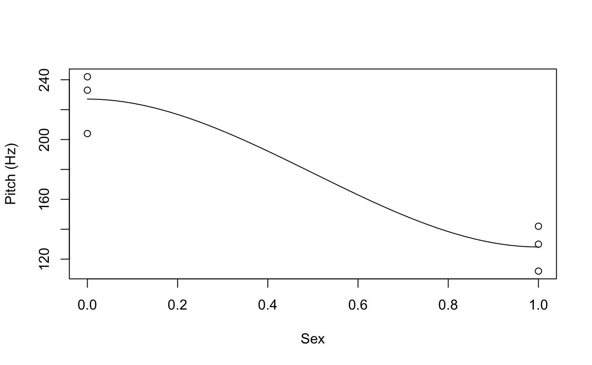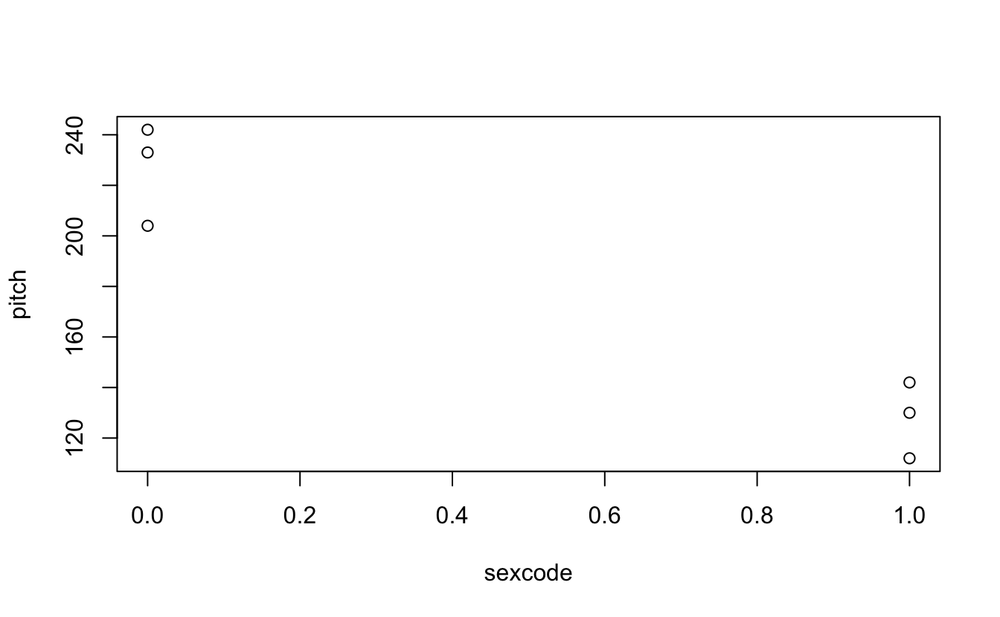

Or with ggplot


```r
coef(xmdl)
#> (Intercept)     sexmale 
#>       226.3       -98.3

sapply(X = my.df, class)
#>         sex       pitch     sexcode 
#> "character"   "numeric"   "numeric"

require(forcats)
my.df %>%
  mutate(sex = fct_recode(sex, "0" = "female", "1" = "male")) %>%
  mutate(sex = as.numeric(as.character(sex))) %>%
  ggplot(aes(x= sex,y=pitch)) +
  geom_point() +
  geom_abline(intercept = coef(xmdl)[1],slope = coef(xmdl)[2]) +
  theme_classic() + coord_cartesian(xlim = c(-.5,1.5), ylim = c(0,300))
```

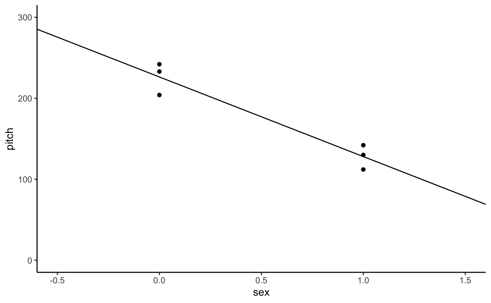


**Challenge 2**

Why did I have to go through all this trouble of getting the slope and intercept, and then changing Sex from a categorical factor to a numerical continuous variable?

Explain the <code>geom_abline</code> call.

What happens if I remove the <code>as.character(sex)</code> from the mutate argument on line above?


```r

my.df %>%
  mutate(sex = fct_recode(sex, "0" = "female", "1" = "male")) %>%
  mutate(sex = as.numeric(sex)) %>%
  ggplot(aes(x= sex,y=pitch)) +
  geom_point() +
  geom_abline(intercept = coef(xmdl)[1],slope = coef(xmdl)[2]) +
  theme_classic() + coord_cartesian(xlim = c(-.5,1.5), ylim = c(0,300))
```

**Challenge 3**

How does <code>coord_cartesian()</code> work? Does it transform any of the stats performed?


```r
my.df %>%
  mutate(sex = fct_recode(sex, "0" = "female", "1" = "male")) %>%
  mutate(sex = as.numeric(as.character(sex))) %>%
  ggplot(aes(x= sex,y=pitch)) +
  geom_point() +
  geom_abline(intercept = coef(xmdl)[1],slope = coef(xmdl)[2]) +
  theme_classic() + coord_cartesian(xlim = c(-.5,1.5), ylim = c(0,300)) +
  geom_vline(aes(xintercept = 0), linetype = 2, alpha = .7) + 
  geom_hline(aes(yintercept = 0), linetype = 2, alpha = .7)
```


**Challenge 4**

Can you put the labels "female" and "male" back on the x-axis?

Hint: Try scale_x_...


```r

my.df %>%
  mutate(sex = fct_recode(sex, "0" = "female", "1" = "male")) %>%
  mutate(sex = as.numeric(as.character(sex))) %>%
  ggplot(aes(x= sex,y=pitch)) +
  geom_point() +
  geom_abline(intercept = coef(xmdl)[1],slope = coef(xmdl)[2]) +
  theme_classic() + coord_cartesian(xlim = c(-.5,1.5), ylim = c(0,300)) +
  geom_vline(aes(xintercept = 0), linetype = 2, alpha = .7) + 
  geom_hline(aes(yintercept = 0), linetype = 2, alpha = .7) + 
  scale_x_continuous(breaks = c(0,1),labels = c("female","male"))
```


Now back to the tutorial.

* Advantages of thinking of categorical things as slopes
  + It transfers to thinking about non-categorial things as slopes.


```r

age = c(14,23,35,48,52,67)
pitch = c(252,244,240,233,212,204)
my.df = data.frame(age,pitch)
xmdl = lm(pitch ~ age, my.df)
summary(xmdl)
#> 
#> Call:
#> lm(formula = pitch ~ age, data = my.df)
#> 
#> Residuals:
#>     1     2     3     4     5     6 
#> -2.34 -2.15  4.77  9.60 -7.76 -2.12 
#> 
#> Coefficients:
#>             Estimate Std. Error t value Pr(>|t|)    
#> (Intercept)  267.076      6.852    39.0  2.6e-06 ***
#> age           -0.910      0.157    -5.8   0.0044 ** 
#> ---
#> Signif. codes:  0 '***' 0.001 '**' 0.01 '*' 0.05 '.' 0.1 ' ' 1
#> 
#> Residual standard error: 6.89 on 4 degrees of freedom
#> Multiple R-squared:  0.894,	Adjusted R-squared:  0.867 
#> F-statistic: 33.6 on 1 and 4 DF,  p-value: 0.00439
```


**Challenge 5**

Plot Voice Pitch by Age with a trend line.

So how does age relate to voice pitch?


Meaningful and meaningless intercepts. How can we make the intercept age = 0 more meaningful? We can center on the average age of our sample...


```r
my.df$age.c = my.df$age - mean(my.df$age)
xmdl = lm(pitch ~ age.c, my.df)
summary(xmdl)
#> 
#> Call:
#> lm(formula = pitch ~ age.c, data = my.df)
#> 
#> Residuals:
#>     1     2     3     4     5     6 
#> -2.34 -2.15  4.77  9.60 -7.76 -2.12 
#> 
#> Coefficients:
#>             Estimate Std. Error t value Pr(>|t|)    
#> (Intercept)  230.833      2.811    82.1  1.3e-07 ***
#> age.c         -0.910      0.157    -5.8   0.0044 ** 
#> ---
#> Signif. codes:  0 '***' 0.001 '**' 0.01 '*' 0.05 '.' 0.1 ' ' 1
#> 
#> Residual standard error: 6.89 on 4 degrees of freedom
#> Multiple R-squared:  0.894,	Adjusted R-squared:  0.867 
#> F-statistic: 33.6 on 1 and 4 DF,  p-value: 0.00439
```


**Some assumptions**

* Linearity
  + Linear models assume that the relationship between your variables is linear, no way!


There are a bunch of tests you can do. Remember these residuals are how far the data point is from the linear model line.

(The red lines indicate the residual values)


```r

ggplot(data = my.df, aes(x = age, y = pitch)) +
  geom_smooth(method = "lm", size = .5, se = F, color = "black") +
  geom_errorbar(aes(ymin = pitch, 
                    ymax = pitch - resid(xmdl)), width = 0, color = "red") +
  geom_point() + 
  geom_point(aes(y = pitch - resid(xmdl)),size = .5) +
  theme_classic()
#> `geom_smooth()` using formula 'y ~ x'

resid(xmdl)
#>     1     2     3     4     5     6 
#> -2.34 -2.15  4.77  9.60 -7.76 -2.12

plot(x = fitted(xmdl),y = residuals(xmdl))
abline(a = 0, b = 0, lty = 3)
```

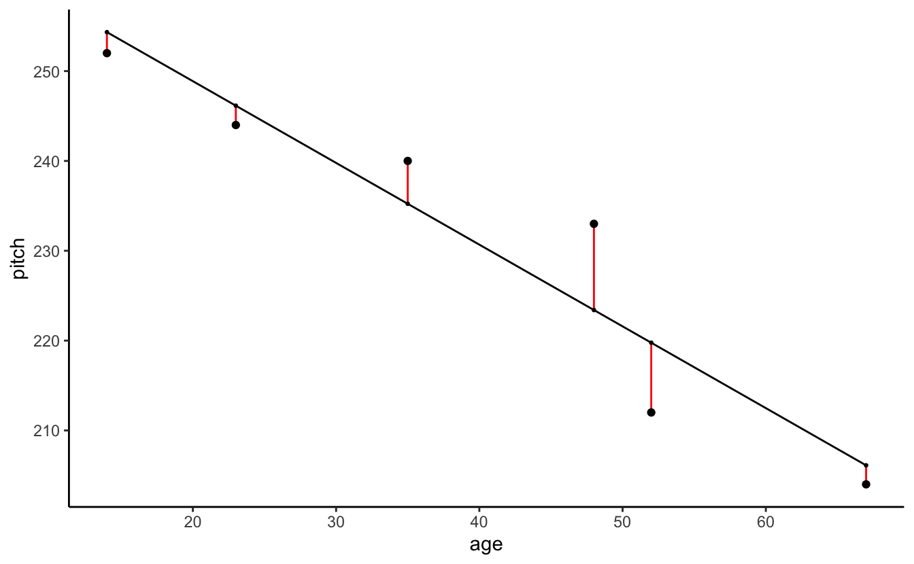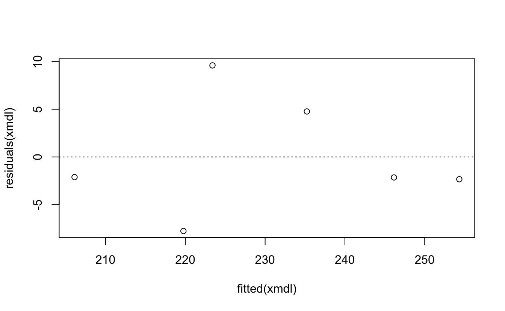

* Colinearity of independent variables (or predictors)
  + Well, we only have one predictor


* Heteroskedasticity
  + Approximately equal variances across your sample


```r
plot(rnorm(100),rnorm(100))
abline(a = 0, b = 0, lty = 3)
```

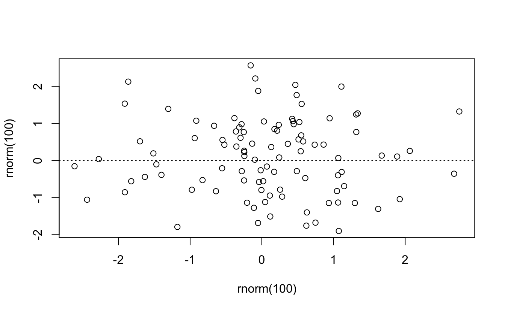


* Normality of residuals


```r
hist(residuals(xmdl), breaks = 6)

qqnorm(residuals(xmdl))
# Seen above with...
plot(xmdl)
```

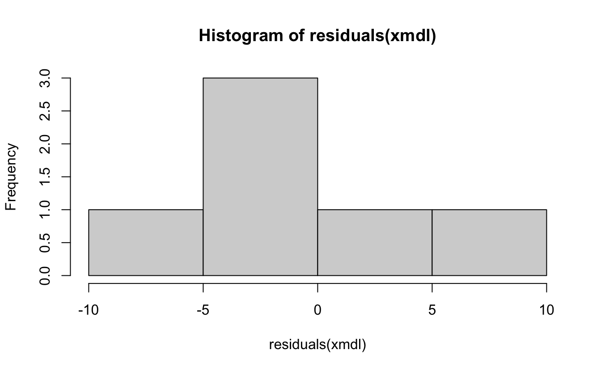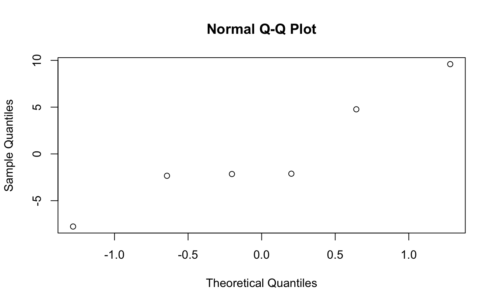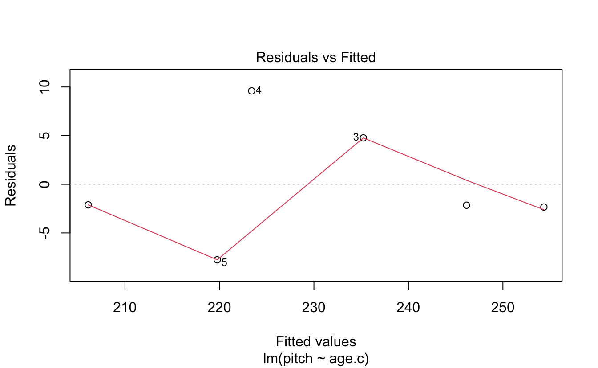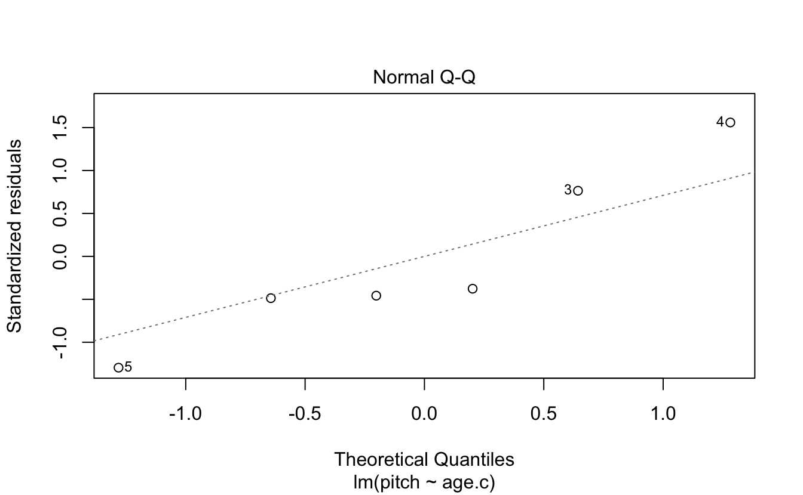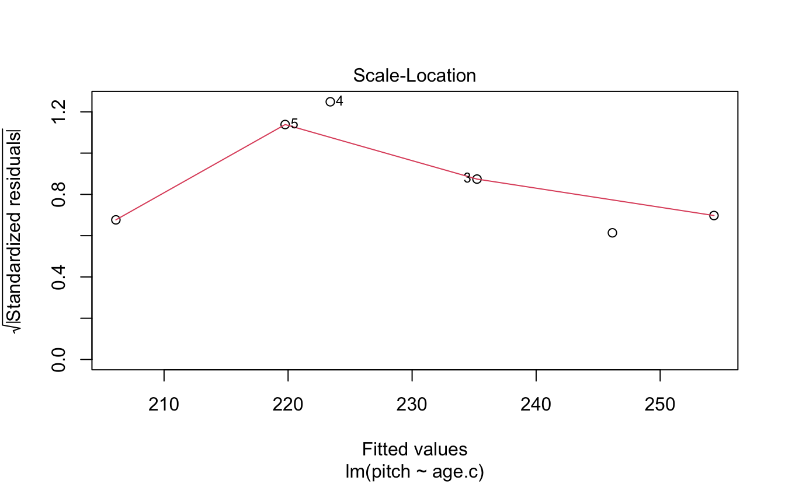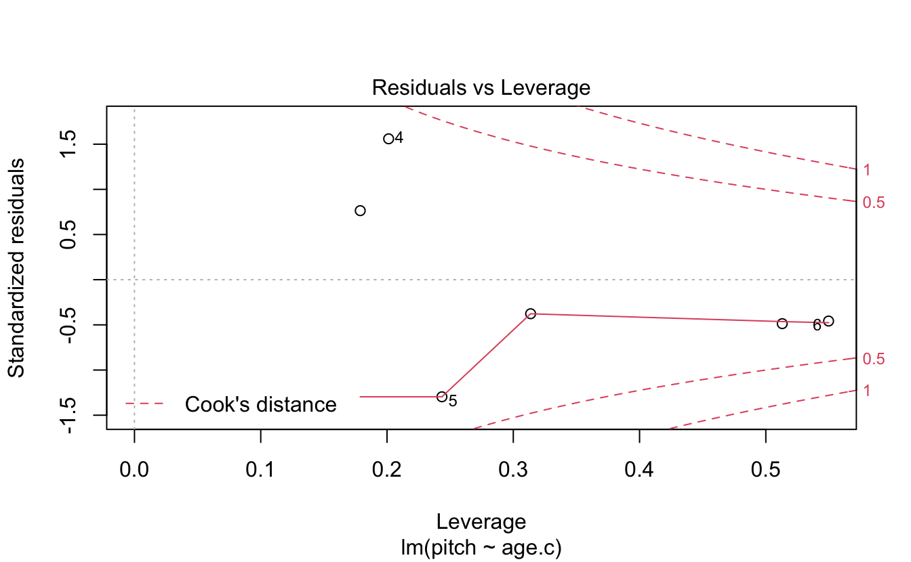


Absence of influential data points...

```r

dfbeta(xmdl)
#>   (Intercept)   age.c
#> 1      -0.800  0.0644
#> 2      -0.522  0.0274
#> 3       0.968 -0.0146
#> 4       2.003  0.0509
#> 5      -1.710 -0.0648
#> 6      -0.783 -0.0662
# (Intercept)       age.c
# 1  -0.8002664  0.06437573
# 2  -0.5220150  0.02736278
# 3   0.9678744 -0.01456709
# 4   2.0026352  0.05092767
# 5  -1.7103247 -0.06479736
# 6  -0.7828787 -0.06622744
```

Finally... Independence! Each observation must be independent from the others. We will deal with repeated measures corrections to linear models by including participants as a random effect (among other things).


## Solutions   

### Challenge 2
If you look back at the box plot that we constructed earlier, you can see that the value 202.588 Hz seems to fall halfway between males and females (in the informal condition) – and this is indeed what this intercept represents. It’s the average of our data for the informal condition.

### Challenge 3
<code>coord_cartesian()</code> works by changing the frame of the data without removing any data points from the summary statistics, such as the best-fit line. So even if the data points are not plotted within the graph, the best-fit line still accounts for the points not shown when its slope is calculated. 

### Challenge 4

```r
my.df %>%
  mutate(sex = fct_recode(sex, "0" = "female", "1" = "male")) %>%
  mutate(sex = as.numeric(as.character(sex))) %>%
  ggplot(aes(x= sex,y=pitch)) +
  geom_point() +
  geom_abline(intercept = coef(xmdl)[1],slope = coef(xmdl)[2]) +
  theme_classic() + coord_cartesian(xlim = c(-.5,1.5), ylim = c(0,300)) +
  geom_vline(aes(xintercept = 0), linetype = 2, alpha = .7) + 
  geom_hline(aes(yintercept = 0), linetype = 2, alpha = .7) + 
  scale_x_continuous(breaks = c(0,1),labels = c("female","male"))
```

### Challenge 5 

```r
my.df %>%
  ggplot(aes(x = age,y = pitch)) + 
  geom_point() + theme_classic() +
  geom_smooth(method = "lm",se = F, color = "black", size = .5) +
  # scale_y_continuous(n.breaks = 50) +
  # coord_cartesian()
```


