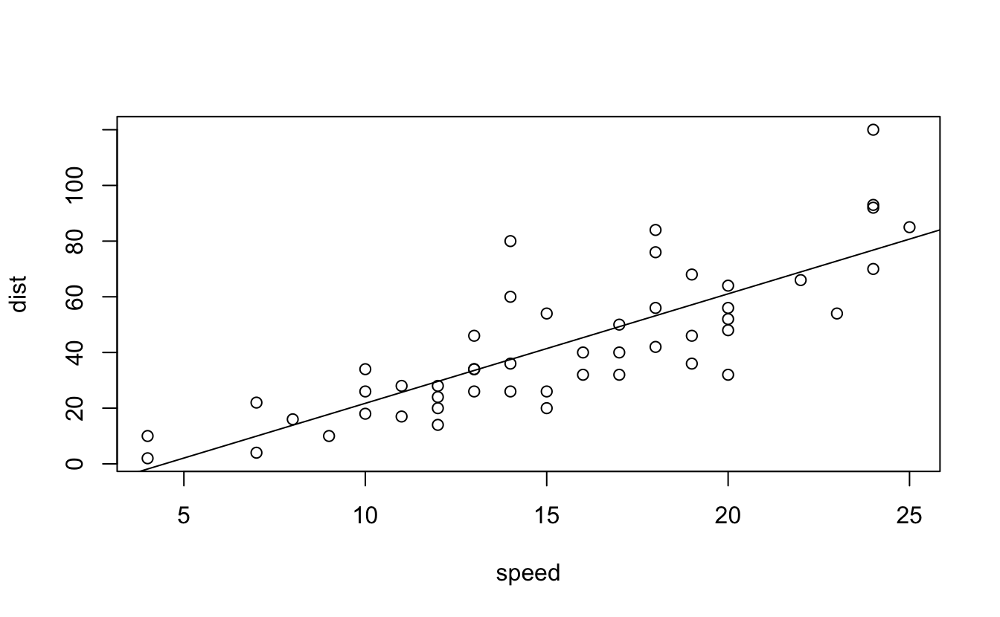

---
output:
  pdf_document: default
  html_document: default
editor_options: 
  markdown: 
    wrap: 72
---

# Rmarkdown

We assume you have already installed R (<https://www.r-project.org>) (R
Core Team 2022) and the RStudio IDE (<https://www.rstudio.com>). RStudio
is not required but recommended, because it makes it easier for an
average user to work with R Markdown. If you do not have RStudio IDE
installed, you will have to install Pandoc (<http://pandoc.org>),
otherwise there is no need to install Pandoc separately because RStudio
has bundled it. Next you can install the rmarkdown package in R:


```r
# Install from CRAN
install.packages('rmarkdown')

# Or if you want to test the development version,
# install from GitHub
if (!requireNamespace("devtools"))
  install.packages('devtools')
devtools::install_github('rstudio/rmarkdown')
```

If you want to generate PDF output, you will need to install LaTeX. For
R Markdown users who have not installed LaTeX before, we recommend that
you install TinyTeX (<https://yihui.name/tinytex/>):


```r
install.packages('tinytex')
tinytex::install_tinytex()  # install TinyTeX
```

TinyTeX is a lightweight, portable, cross-platform, and easy-to-maintain
LaTeX distribution. The R companion package tinytex (Xie 2022c) can help
you automatically install missing LaTeX packages when compiling LaTeX or
R Markdown documents to PDF, and also ensures a LaTeX document is
compiled for the correct number of times to resolve all
cross-references. If you do not understand what these two things mean,
you should probably follow our recommendation to install TinyTeX,
because these details are often not worth your time or attention.

With the rmarkdown package, RStudio/Pandoc, and LaTeX, you should be
able to compile most R Markdown documents. In some cases, you may need
other software packages, and we will mention them when necessary.

**Challenge 1** Install Rmarkdown and TinyTex to output a PDF document.

## Basics

R Markdown provides an authoring framework for data science. You can use
a single R Markdown file to both

save and execute code, and

generate high quality reports that can be shared with an audience.

R Markdown was designed for easier reproducibility, since both the
computing code and narratives are in the same document, and results are
automatically generated from the source code. R Markdown supports dozens
of static and dynamic/interactive output formats.

If you prefer a video introduction to R Markdown, we recommend that you
check out the website <https://rmarkdown.rstudio.com>, and watch the
videos in the "Get Started" section, which cover the basics of R
Markdown.

Below is a minimal R Markdown document, which should be a plain-text
file, with the conventional extension .Rmd:


```r
---
title: "Hello R Markdown"
author: "Awesome Me"
date: "2018-02-14"
output: html_document
---
```

This is a paragraph in an R Markdown document.

Below is a code chunk:


```r
fit <- lm(dist ~ speed, data = cars)
b   <-  coef(fit)
plot(cars)
abline(fit)
```




The slope of the regression is 3.932.

**Challenge 2** Recreate the code chunk above and knit it.

**Challenge 3** Recreate the in-line code and knit your Rmarkdown file
again.

The usual way to compile an R Markdown document is to click the Knit
button as shown in Figure 2.1, and the corresponding keyboard shortcut
is Ctrl + Shift + K (Cmd + Shift + K on macOS). Under the hood, RStudio
calls the function rmarkdown::render() to render the document in a new R
session. Please note the emphasis here, which often confuses R Markdown
users. Rendering an Rmd document in a new R session means that none of
the objects in your current R session (e.g., those you created in your R
console) are available to that session. 2 Reproducibility is the main
reason that RStudio uses a new R session to render your Rmd documents:
in most cases, you may want your documents to continue to work the next
time you open R, or in other people's computing environments. See this
StackOverflow answer if you want to know more.

If you must render a document in the current R session, you can also
call rmarkdown::render() by yourself, and pass the path of the Rmd file
to this function. The second argument of this function is the output
format, which defaults to the first output format you specify in the
YAML metadata (if it is missing, the default is html_document). When you
have multiple output formats in the metadata, and do not want to use the
first one, you can specify the one you want in the second argument,
e.g., for an Rmd document foo.Rmd with the metadata:


```r
---
output:
  html_document:
    toc: true
  pdf_document:
    keep_tex: true
---
```

You can render it to PDF via:


```r
rmarkdown::render('foo.Rmd', 'pdf_document')
```

The function call gives you much more freedom (e.g., you can generate a
series of reports in a loop), but you should bear reproducibility in
mind when you render documents this way. Of course, you can start a new
and clean R session by yourself, and call rmarkdown::render() in that
session. As long as you do not manually interact with that session
(e.g., manually creating variables in the R console), your reports
should be reproducible.

Another main way to work with Rmd documents is the R Markdown Notebooks.

A few R Markdown extension packages, such as bookdown and blogdown, have
their own way of compiling documents, and we will introduce them later.
It is also possible to render a series of reports instead of single one
from a single R Markdown source document. You can parameterize an R
Markdown document, and generate different reports using different
parameters.

## Output Formats

There are two types of output formats in the rmarkdown package:
documents, and presentations. All available formats are listed below:

-   <code>beamer_presentation</code>
-   <code>context_document</code>
-   <code>github_document</code>
-   <code>html_document</code>
-   <code>ioslides_presentation</code>
-   <code>latex_document</code>
-   <code>md_document</code>
-   <code>odt_document</code>
-   <code>pdf_document</code>
-   <code>powerpoint_presentation</code>
-   <code>rtf_document</code>
-   <code>slidy_presentation</code>
-   <code>word_document</code>

Each output format is often accompanied with several format options. All
these options are documented on the R package help pages. For example,
you can type ?rmarkdown::html_document in R to open the help page of the
html_document format. When you want to use certain options, you have to
translate the values from R to YAML, e.g.,


```r
html_document(toc = TRUE, toc_depth = 2, dev = 'svg')
```

can be written in YAML as:


```r
output:
  html_document:
    toc: true
    toc_depth: 2
    dev: 'svg'
```

## Rmarkdown Syntax

The text in an R Markdown document is written with the Markdown syntax.
Precisely speaking, it is Pandoc's Markdown. There are many flavors of
Markdown invented by different people, and Pandoc's flavor is the most
comprehensive one to our knowledge. You can find the full documentation
of Pandoc's Markdown at <https://pandoc.org/MANUAL.html>. We strongly
recommend that you read this page at least once to know all the
possibilities with Pandoc's Markdown, even if you will not use all of
them. This section is adapted from Section 2.1 of Xie (2016), and only
covers a small subset of Pandoc's Markdown syntax.

### In-line Formatting

Inline text will be italic if surrounded by underscores or asterisks,
e.g., \_text\_ or \*text\*. Bold text is produced using a pair of double
asterisks (\*\*text\*\*). A pair of tildes (\~) turn text to a subscript
(e.g., H\~3\~PO\~4\~ renders H~3~PO~4~). A pair of carets (\^) produce a
superscript (e.g., Cu\^2+\^ renders Cu^2+^).

<!--- Hyperlinks are created using the syntax \[text\\]\(link\), e.g., \[RStudio\](https://www.rstudio.com). The syntax for images is similar: just add an exclamation mark, e.g., !\[alt text or image title\](path/to/image). Footnotes are put inside the square brackets after a caret \^[], e.g., ^[This is a footnote.]. ---->


There are multiple ways to insert citations, and we recommend that you
use BibTeX databases, because they work better when the output format is
LaTeX/PDF. Section 2.8 of Xie (2016) has explained the details. The key
idea is that when you have a BibTeX database (a plain-text file with the
conventional filename extension .bib) that contains entries like:

**Challenge 4** Write some Bold and Italicized Text and knit the
document.

**Challenge 5** Run an in-line code chunk, such as the output of the
first cell of your data.frame

<https://rmarkdown.rstudio.com/authoring_basics.html>

<https://www.rstudio.com/wp-content/uploads/2015/02/rmarkdown-cheatsheet.pdf>

# Rmarkdown Day 2

There are a lot of things you can do in a code chunk: you can produce
text output, tables, or graphics. You have fine control over all these
output via chunk options, which can be provided inside the curly braces
(between \`\`\`{r and }). For example, you can choose hide text output
via the chunk option results = 'hide', or set the figure height to 4
inches via fig.height = 4. Chunk options are separated by commas, e.g.,


```r
#```{r, chunk-label, results='hide', fig.height=4}
```

The value of a chunk option can be an arbitrary R expression, which
makes chunk options extremely flexible. For example, the chunk option
eval controls whether to evaluate (execute) a code chunk, and you may
conditionally evaluate a chunk via a variable defined previously, e.g.,

<code>\`\`\`{r} \# execute code if the date is later than a specified
day do_it = Sys.Date() \> '2018-02-14' \`\`\`

\`\`\`{r, eval=do_it} x = rnorm(100) \`\`\` </code>

There are a large number of chunk options in knitr documented at
<https://yihui.name/knitr/options>. We list a subset of them below:

-   eval: Whether to evaluate a code chunk.

***Challenge 1*** Set eval to false in your code chunk.

-   echo: Whether to echo the source code in the output document
    (someone may not prefer reading your smart source code but only
    results).

-   results: When set to 'hide', text output will be hidden; when set to
    'asis', text output is written "as-is," e.g., you can write out raw
    Markdown text from R code (like cat('**Markdown** is cool.\n')). By
    default, text output will be wrapped in verbatim elements (typically
    plain code blocks).

-   collapse: Whether to merge text output and source code into a single
    code block in the output. This is mostly cosmetic: collapse = TRUE
    makes the output more compact, since the R source code and its text
    output are displayed in a single output block. The default collapse
    = FALSE means R expressions and their text output are separated into
    different blocks.

-   warning, message, and error: Whether to show warnings, messages, and
    errors in the output document. Note that if you set error = FALSE,
    rmarkdown::render() will halt on error in a code chunk, and the
    error will be displayed in the R console. Similarly, when warning =
    FALSE or message = FALSE, these messages will be shown in the R
    console.

-   include: Whether to include anything from a code chunk in the output
    document. When include = FALSE, this whole code chunk is excluded in
    the output, but note that it will still be evaluated if eval = TRUE.
    When you are trying to set echo = FALSE, results = 'hide', warning =
    FALSE, and message = FALSE, chances are you simply mean a single
    option include = FALSE instead of suppressing different types of
    text output individually.

-   cache: Whether to enable caching. If caching is enabled, the same
    code chunk will not be evaluated the next time the document is
    compiled (if the code chunk was not modified), which can save you
    time. However, I want to honestly remind you of the two hard
    problems in computer science (via Phil Karlton): naming things, and
    cache invalidation. Caching can be handy but also tricky sometimes.

-   fig.width and fig.height: The (graphical device) size of R plots in
    inches. R plots in code chunks are first recorded via a graphical
    device in knitr, and then written out to files. You can also specify
    the two options together in a single chunk option fig.dim, e.g.,
    fig.dim = c(6, 4) means fig.width = 6 and fig.height = 4.

***Challenge 2*** Set figure width and figure height to 6 and 4 in a
plot of your data.

-   out.width and out.height: The output size of R plots in the output
    document. These options may scale images. You can use percentages,
    e.g., out.width = '80%' means 80% of the page width.

-   fig.align: The alignment of plots. It can be 'left', 'center', or
    'right'.

-   dev: The graphical device to record R plots. Typically it is 'pdf'
    for LaTeX output, and 'png' for HTML output, but you can certainly
    use other devices, such as 'svg' or 'jpeg'.

-   fig.cap: The figure caption. ***Challenge 3*** Give your figure a
    caption

-   child: You can include a child document in the main document. This
    option takes a path to an external file.

If a certain option needs to be frequently set to a value in multiple
code chunks, you can consider setting it globally in the first code
chunk of your document, e.g.,

<code> \`\`\`{r, setup, include=FALSE} knitr::opts_chunk\$set(fig.width
= 8, collapse = TRUE) \`\`\` </code>
